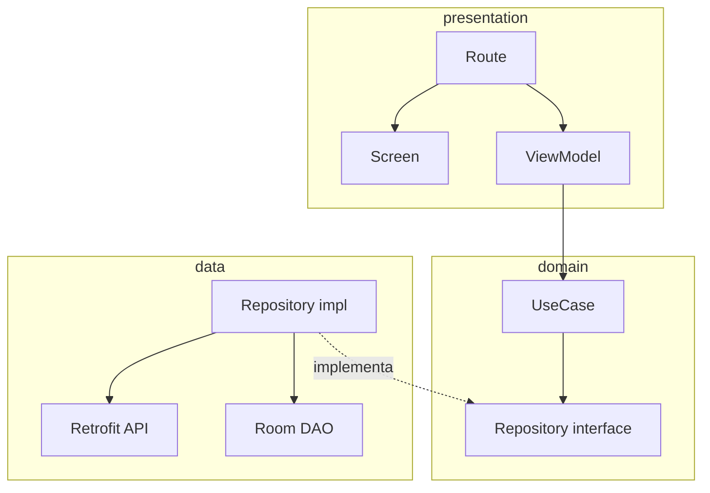

# Skill `documentar-modulo` — docs internas por módulo

Genera los cuatro archivos de documentación que cada módulo del proyecto Android Mango Fake Store debe acompañar según §12 del prompt maestro. Toda la salida es en español.

## Cuándo usar

- Después de `/speckit-implement` cuando el módulo recién terminado no tiene aún `docs/`.
- Cuando el usuario diga "documenta el módulo `X`", "actualiza la doc de `Y`", "genera `errores.md` de `Z`".
- Cuando un módulo añada nuevas ramas a su `sealed interface <Modulo>Error`.

NO usar para:
- README raíz del repo (`README.md` general del proyecto).
- ADRs globales (`docs/adr/NNNN-titulo.md`).
- Diagramas de producto / wireframes (`docs/diseno/`).
- Documentación de skills (esos se autodocumentan en su propio `SKILL.md`).

## Inputs

| Input | Obligatorio | Por defecto | Ejemplo |
|---|---|---|---|
| `modulo` | sí | — | `products`, `favorites`, `core:network` |
| `archivos` | no | los 4 | subset de `[modulo, diseno, pruebas, errores]` |
| `modo` | no | `crear-o-sobrescribir` | `crear-o-sobrescribir`, `actualizar`, `solo-faltantes` |

## Detección automática

1. Identificar la ruta del módulo (`features/<modulo>/` o `core/<modulo>/`).
2. Listar archivos `.kt` del módulo para inferir:
   - Casos de uso (`domain/casosdeuso/*.kt`) → entrar en `modulo.md` como contratos.
   - `sealed interface *Error` (`domain/errors/*.kt`) → enumerar en `errores.md`.
   - Repositorios (`data/repositorios/*.kt`) → mencionar en `diseno.md`.
   - ViewModels (`presentation/viewmodel/*.kt`) → mencionar en `diseno.md`.
3. Leer `build.gradle.kts` para detectar dependencias de proyecto y plasmarlas en `modulo.md`.

## Plantillas (asset/templates/)

- `modulo.md.template`
- `diseno.md.template`
- `pruebas.md.template`
- `errores.md.template`

## Estructura del output

### `modulo.md`

```markdown
# Módulo `:features:<modulo>` (o `:core:<modulo>`)

**Propósito**: <una frase>.

## Contratos públicos

Exportados en `:features:<modulo>:api` y `:features:<modulo>:domain`:

| Símbolo | Descripción | Retorno |
|---|---|---|
| ... | ... | `Either<DomainError, T>` |

## Dependencias

- `:core:common`, `:core:error` (siempre)
- `:core:<otros>` y `:features:<otros>:api` según corresponda

## Ejemplos de uso

```kotlin
class MiViewModel @Inject constructor(
    private val obtenerProductos: ObtenerProductos,
) : ViewModel() { /* ... */ }
```

## Estructura interna

```
features/<modulo>/
├── api/         contratos públicos
├── domain/      casos de uso, modelos, errores
├── data/        repositorios, fuentes, mappers
└── presentation/ viewmodels, composables
```

## Cómo regenerar esta documentación

```
/documentar-modulo modulo=<modulo>
```
```

### `diseno.md`

Incluye diagrama Mermaid:



Más decisiones puntuales del módulo y puntos de extensión.

### `pruebas.md`

Lista de tests por capa, comandos Gradle, umbrales de cobertura del módulo y nombres convencionales (`*UseCaseTest`, `*RepositoryTest`, `*ViewModelTest`, `*SnapshotTest`).

### `errores.md`

Una tabla obligatoria:

| `DomainError` | Condición | `UiError.severity` | `R.string` |
|---|---|---|---|
| `Network.NoConnection` | sin red al iniciar carga | `Warning` | `error_red_sin_conexion` |
| `Network.Timeout` | timeout >10s | `Warning` | `error_red_tiempo` |
| `<Modulo>Error.<Caso>` | <condición específica> | `Blocking` | `error_<modulo>_<caso>` |

## Reporte final

```
✅ Docs de `:features:<modulo>` generadas/actualizadas.

Archivos:
  features/<modulo>/docs/modulo.md     (creado | actualizado)
  features/<modulo>/docs/diseno.md     (creado | actualizado)
  features/<modulo>/docs/pruebas.md    (creado | actualizado)
  features/<modulo>/docs/errores.md    (creado | actualizado)

Errores documentados: N
Casos de uso documentados: M
```

## Reglas de estilo

- Idioma 100% español, incluido los identificadores `mermaid` (si se usan etiquetas en español).
- Tablas Markdown formateadas con padding consistente.
- Bloques de código con language hint (`kotlin`, `bash`, `mermaid`).
- No fabricar `R.string` que no existan; si la cadena aún no está, marcar con `_(pendiente)_`.
- Nunca incluir secretos, tokens ni rutas a `local.properties`.
