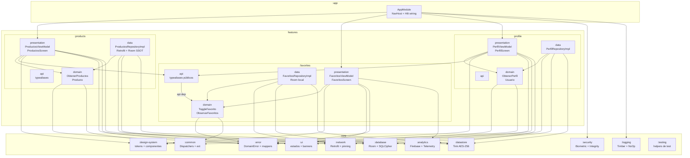

# Mango Fake Store App

[](https://github.com/spanesso/android-fake-store-app/actions/workflows/pr.yml)
[](https://developer.android.com/)
[](https://kotlinlang.org/)
[](LICENSE)

---

## Visión

Mango Fake Store App es una aplicación Android de catálogo de moda para compradores de Mango Fashion Group. Permite explorar productos, marcar favoritos y gestionar el perfil de usuario. Fue desarrollada como prueba técnica profesional para demostrar capacidades de arquitectura Android de nivel senior.

**Lo que hace la app:**
- Navegar por un catálogo de productos con filtros y búsqueda
- Agregar y quitar productos de favoritos (persistidos localmente)
- Ver y gestionar el perfil de usuario con autenticación biométrica

**Para quién:** Compradores de moda que quieren guardar artículos favoritos para comprar más tarde.

---

## Arquitectura

La app sigue **Clean Architecture + MVVM** con módulos Gradle independientes por capa.



### Capas y sus responsabilidades

| Capa | Responsabilidad | Depende de |
|------|----------------|------------|
| `presentation` | ViewModel + UiState + Composables puros | `domain`, `core:design-system`, `core:ui` |
| `domain` | Casos de uso + entidades + repositorios (interfaces) | `core:error`, `core:common` |
| `data` | Repositorios (implementación) + mappers + fuentes de datos | `domain`, `core:network`, `core:database` |
| `api` | Contratos públicos para consumo inter-feature | `domain` (via `api()`) |

---

## Cómo correr en local

### Requisitos previos

| Herramienta | Versión mínima |
|-------------|---------------|
| Java (JDK) | 11 |
| Android Studio | Hedgehog 2023.1.1+ |
| Android SDK | compileSdk 36, minSdk 24 |
| Gradle | 8.10+ (incluido en el wrapper) |

### Pasos

```bash
# 1. Clonar el repositorio
git clone https://github.com/spanesso/android-fake-store-app.git
cd android-fake-store-app

# 2. Compilar la app (flavor dev, debug)
./gradlew assembleDevDebug

# 3. Instalar en emulador o dispositivo conectado
./gradlew installDevDebug

# 4. O abrir en Android Studio y presionar ▶ Run
```

### Flavors disponibles

| Flavor | Uso | IntegrityPolicy |
|--------|-----|-----------------|
| `dev` | Desarrollo local | `LOG` (solo registra) |
| `staging` | QA y distribución interna | `WARN` (avisa pero no bloquea) |
| `prod` | Producción | `BLOCK` (bloquea en dispositivos comprometidos) |

### Variables de entorno para release build

```bash
KEYSTORE_PATH=/ruta/al/keystore.jks
KEYSTORE_PASSWORD=contraseña_keystore
KEY_ALIAS=alias_clave
KEY_PASSWORD=contraseña_clave
RELEASE_CERT_HASH=hash_sha256_del_certificado_apk
```

---

## Cómo testear

### Ejecutar todos los tests unitarios

```bash
./gradlew testDevDebugUnitTest
```

### Tests por módulo

```bash
# Módulos core
./gradlew :core:common:testDebugUnitTest          # 24 tests
./gradlew :core:error:testDebugUnitTest           # 33+ tests (con mapper)
./gradlew :core:ui:testDebugUnitTest              # 16 tests
./gradlew :core:network:testDevDebugUnitTest      # 22 tests
./gradlew :core:database:testDebugUnitTest        # 6 tests
./gradlew :core:datastore:testDebugUnitTest       # 8 tests
./gradlew :core:analytics:testDebugUnitTest       # 13 tests
./gradlew :core:security:testDebugUnitTest        # 8 tests
./gradlew :core:logging:testDebugUnitTest         # 14 tests

# Módulos features
./gradlew :features:products:domain:testDebugUnitTest        # 7 tests
./gradlew :features:products:presentation:testDebugUnitTest  # 8 tests
./gradlew :features:favorites:domain:testDebugUnitTest       # 9 tests
./gradlew :features:favorites:data:testDebugUnitTest         # 7 tests
./gradlew :features:favorites:presentation:testDebugUnitTest # 6 tests
./gradlew :features:profile:domain:testDebugUnitTest         # ~8 tests
./gradlew :features:profile:presentation:testDebugUnitTest   # ~8 tests

# Snapshots Paparazzi (core:design-system)
./gradlew :core:design-system:recordPaparazziDebug   # grabar golden images
./gradlew :core:design-system:verifyPaparazziDebug   # verificar snapshots

# Análisis estático
./gradlew detekt
./gradlew lint
```

### Cobertura con Kover

```bash
# Generar informe HTML (abre en el navegador)
./gradlew koverHtmlReportDevDebug
open build/reports/kover/html/index.html

# Generar informe XML (para CI/SonarCloud)
./gradlew koverXmlReportDevDebug
# Salida: build/reports/kover/xml/report.xml

# Verificar umbrales (falla si no se cumplen)
./gradlew koverVerify
```

**Umbrales de cobertura por capa:**
- `domain` ≥ 90 % (happy path + una prueba por cada rama de `DomainError`)
- `data` ≥ 80 % (repositorios con `MockWebServer` + Room en memoria + mappers)
- `presentation` ≥ 70 % (ViewModels con Turbine + tests de Compose)

**Interpretar el informe Kover HTML:**
1. Abre `build/reports/kover/html/index.html`
2. La primera columna lista módulos; la columna `Lines` muestra el porcentaje cubierto
3. Haz clic en un módulo para ver cobertura por clase
4. Líneas rojas = no cubiertas; líneas verdes = cubiertas; amarillas = parcialmente cubiertas

---

## Cómo desplegar

### APK de depuración

```bash
./gradlew assembleDevDebug          # APK flavor dev
./gradlew assembleStagingDebug      # APK flavor staging
```

El APK generado estará en `app/build/outputs/apk/<flavor>/debug/`.

### APK de producción (release)

```bash
# Requiere las variables de entorno KEYSTORE_* configuradas
./gradlew assembleProdRelease
```

### Bundle AAB para Google Play

```bash
./gradlew bundleProdRelease
# Salida: app/build/outputs/bundle/prodRelease/app-prod-release.aab
```

### Distribución interna con Firebase App Distribution

```bash
# Requiere el plugin com.google.firebase.appdistribution y credenciales configuradas
./gradlew assembleStagingRelease appDistributionUploadStagingRelease
```

### Pipeline CI/CD

El repositorio tiene tres workflows de GitHub Actions:

| Workflow | Disparo | Jobs |
|----------|---------|------|
| `pr.yml` | PR a `develop` | setup, lint, test, coverage, build, sonarcloud |
| `main.yml` | push a `main` | build, test, distribute (Firebase App Distribution) |
| `release.yml` | tag `v*` | build release, upload Play Store (internal track) |

**Secretos necesarios en GitHub Actions:**

| Secreto | Obligatorio | Uso |
|---------|-------------|-----|
| `KEYSTORE_FILE_BASE64` | Sí (release) | Firmado del APK/AAB |
| `KEYSTORE_PASSWORD` | Sí (release) | Clave de keystore |
| `KEY_ALIAS` | Sí (release) | Alias de la clave de firma |
| `KEY_PASSWORD` | Sí (release) | Contraseña de la clave |
| `RELEASE_CERT_HASH` | Sí (release) | Certificate pinning — SHA-256 del APK en prod |
| `FIREBASE_APP_ID` | Sí (distribución) | App ID de Firebase |
| `FIREBASE_TOKEN` | Sí (distribución) | Token CLI de Firebase |
| `ANDROID_PUBLISHER_CREDENTIALS_FILE` | Sí (Play) | JSON de cuenta de servicio Google |
| `SONAR_TOKEN` | Opcional | Análisis de calidad en SonarCloud |
| `GOOGLE_SERVICES_JSON` | Sí (staging/prod) | Configuración de Firebase |

---

## Herramientas opcionales

### SonarCloud (análisis de calidad)

SonarCloud ya está integrado en el pipeline `pr.yml` con `continue-on-error: true`. Para activarlo completamente:

1. Ir a [sonarcloud.io](https://sonarcloud.io) → `My Account` → `Organizations` → crear organización `spanesso`
2. Importar el repositorio `android-fake-store-app`
3. En `Administration → Analysis Method` → desactivar **Automatic Analysis** (¡importante!)
4. En GitHub → `Settings → Secrets → Actions` → añadir `SONAR_TOKEN` con el token de SonarCloud
5. El siguiente PR ejecutará el análisis automáticamente

### `act` — CI local

Para ejecutar el pipeline de PR localmente sin push a GitHub:

```bash
# Instalar act (macOS)
brew install act

# Simular el trigger de un PR (usa Docker)
act pull_request --secret-file .secrets -P ubuntu-latest=ghcr.io/catthehacker/ubuntu:act-latest

# Solo el job de tests
act pull_request -j test
```

Requiere Docker Desktop en ejecución. El archivo `.secrets` (no commiteado) debe contener:
```
SONAR_TOKEN=<tu_token>
GOOGLE_SERVICES_JSON=<contenido_del_json>
```

### Firebase App Distribution — distribución interna

Para distribuir compilaciones de staging al equipo de QA:

```bash
# Configurar CLI de Firebase
npm install -g firebase-tools
firebase login

# Subir una build manualmente
./gradlew assembleStagingRelease
firebase appdistribution:distribute app/build/outputs/apk/staging/release/app-staging-release.apk \
  --app $FIREBASE_APP_ID \
  --groups "testers-internos" \
  --release-notes "Build de staging $(date +%Y-%m-%d)"
```

---

## Stack tecnológico

| Tecnología | Versión | Uso |
|------------|---------|-----|
| Kotlin | 2.0.21 | Lenguaje principal |
| Android Gradle Plugin | 9.0.1 | Sistema de build |
| Jetpack Compose BOM | 2024.09.00 | UI declarativa |
| Material3 | incluido en BOM | Componentes base (solo en `:core:design-system`) |
| Arrow Core | 1.2.4 | `Either<DomainError, T>` para errores tipados |
| Hilt | 2.52 | Inyección de dependencias |
| Room | 2.7.1 | Base de datos local con KSP |
| SQLCipher | 4.6.0 | Cifrado de la BD |
| Tink Android | 1.15.0 | Cifrado AES-256-GCM en DataStore |
| Retrofit | 2.11.0 | Cliente HTTP REST |
| OkHttp | 4.12.0 | HTTP + certificate pinning |
| Firebase BOM | 33.6.0 | Crashlytics + Analytics + Performance |
| Kover | 0.9.8 | Cobertura de tests |
| Detekt | 1.23.7 | Análisis estático Kotlin |
| Konsist | 0.17.3 | Verificación de arquitectura en CI |
| Paparazzi | 1.3.5 | Snapshot tests de Compose |
| Min SDK | 24 | Android 7.0+ |
| Target SDK | 36 | Android 16 |

---

## Módulos implementados

| Módulo | Descripción | Tests |
|--------|-------------|-------|
| `:core:common` | Dispatchers inyectables, extensiones `Either`/`Flow` | 24 |
| `:core:error` | `DomainError` sealed, `UiError`, `safeApiCall`, mappers | 33 |
| `:core:design-system` | Tokens visuales Mango + 19 componentes Compose | 9 (Paparazzi) |
| `:core:ui` | `LoadingContent`, `ErrorContent`, `MangoOfflineBanner`, shimmer | 16 |
| `:core:network` | Retrofit + OkHttp, certificate pinning, retry, `ConnectivityObserver` | 22 |
| `:core:database` | Room abstracta cifrada con SQLCipher + Android Keystore | 6 |
| `:core:datastore` | DataStore cifrado con Tink AES-256-GCM | 8 |
| `:core:analytics` | `Telemetry` + `EventTracker`; Firebase impl; Console + NoOp | 13 |
| `:core:security` | `BiometricAuthenticator`, `IntegrityChecker`, `SecureScreen` | 8 |
| `:core:logging` | `Logger` interface; `TimberLogger` (debug) + `NoOpLogger` (prod) | 14 |
| `:core:testing` | `CoroutineTestRule`, `TestAppDispatchers`, builders | — |
| `:features:products` | Catálogo SSOT (Room + Retrofit), MVVM, Either tipado | 15 |
| `:features:favorites` | Favoritos persistidos en Room, toggle reactivo, contador | 22 |
| `:features:profile` | Perfil con `SecureScreen`, contador favoritos reactivo | 42 |
| `:app` | NavHost type-safe, BottomBar, gateway biométrico, banner offline | 9 |

**Total tests**: ~270 ✅

---

## Documentación

| Recurso | Descripción |
|---------|-------------|
| [`docs/arquitectura.md`](docs/arquitectura.md) | Diagrama de módulos, matriz de dependencias, convenciones |
| [`docs/seguridad.md`](docs/seguridad.md) | Threat model STRIDE, certificate pinning, secretos |
| [`docs/ci-cd.md`](docs/ci-cd.md) | Pipeline GitHub Actions, jobs y secretos necesarios |
| [`docs/observabilidad.md`](docs/observabilidad.md) | Firebase Crashlytics, Analytics, Performance; política PII |
| [`docs/adr/`](docs/adr/) | Decisiones de arquitectura (ADRs 0001–0004) |
| `features/<modulo>/docs/` | Documentación por feature: módulo, diseño, pruebas, errores |
| `core/<modulo>/docs/` | Documentación por módulo core |

---

## Manejo de errores

Todos los errores fluyen tipados a través del sistema:

```
fuente de datos → safeApiCall/safeDbCall → Either<DomainError, T>
          ↓
    caso de uso → propaga Either<DomainError, T>
          ↓
    ViewModel → DomainErrorToUiErrorMapper → UiError
          ↓
    UI → stringResource(uiError.messageRes) → MangoErrorState / MangoSnackbar
```

La UI nunca lee `throwable.message` directamente. Ver [`docs/adr/0001-manejo-errores.md`](docs/adr/0001-manejo-errores.md).
