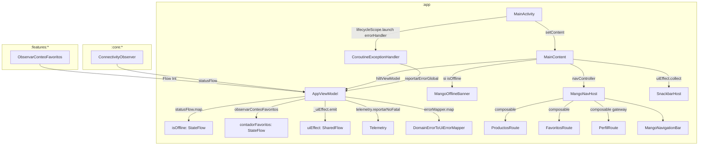

# Diseño — Módulo `:app`

## Diagrama de flujo



---

## Flujo de navegación

```
AppRoute
├── Productos  (startDestination)
├── Favoritos
└── Perfil
```

**Handler global** (MainActivity + AppViewModel):
1. Excepción no capturada en `lifecycleScope.launch(errorHandler)`
2. `CoroutineExceptionHandler` llama a `appViewModel.reportarErrorGlobal(throwable)`
3. `AppViewModel` mapea `Throwable → DomainError.Unknown → UiError`
4. `telemetry.reportarNoFatal(domainError)` — reporta a Firebase Crashlytics
5. `_uiEffect.emit(MostrarErrorGlobal(uiError))` — `MainContent` muestra Snackbar

---

## Decisiones de diseño

| Decisión | Alternativa descartada | Razón |
|---|---|---|
| `sesionAutenticada` en `AppViewModel` como `mutableStateOf` | DataStore persistido | La sesión debe reiniciarse al matar la Activity; no debe persistir entre sesiones |
| NavHost en `MangoNavHost.kt` con Scaffold propio | Scaffold único en MainActivity | Permite aislar la lógica de navegación y testarla independientemente |
| `CoroutineExceptionHandler` en `lifecycleScope` de Activity | `Thread.setUncaughtExceptionHandler` | Integración nativa con Compose y corrutinas; la app sigue funcionando |
| `SharingStarted.WhileSubscribed(5_000)` en StateFlows | `Eagerly` | Evita colecciones innecesarias cuando la UI está en background; 5s de gracia para rotaciones |
| Badge en `MangoNavigationBar` via `BadgedBox` | Estado local en `MangoNavHost` | Reactivo al StateFlow `contadorFavoritos` en `AppViewModel` |

---

## Puntos de extensión

- Añadir nuevos destinos: crear `@Serializable data object NuevoDestino : AppRoute`, añadir `composable<AppRoute.NuevoDestino>` en `MangoNavHost`, y añadir `MangoNavItem` en la lista.
- Añadir deep links adicionales: añadir `navDeepLink { uriPattern = "mango://fakestore/nuevo" }` en el `composable<>` correspondiente y el `<intent-filter>` en `AndroidManifest.xml`.
