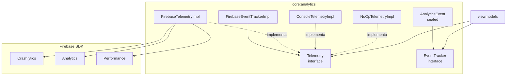

# Diseño — `:core:analytics`

## Diagrama de arquitectura

## Decisiones de diseño

### Separación Telemetry / EventTracker

`Telemetry` gestiona la infraestructura de observabilidad de bajo nivel (Crashlytics, Firebase Performance). `EventTracker` es la interfaz de alto nivel orientada al dominio de negocio. Esto permite:
- Cambiar el backend de analytics sin tocar el código de dominio.
- Usar `NoOpTelemetryImpl` en tests sin dependencias Firebase.

### NoOp como fake de tests

`NoOpTelemetryImpl` y `NoOpEventTrackerImpl` son las implementaciones usadas en tests unitarios. Ningún test de feature necesita mockear Firebase directamente.

### Datadog / Sentry (R0.12)

Las implementaciones de Datadog y Sentry no se incluyen en el grafo por defecto. Si la empresa las provee:
1. Crear `DatadogTelemetryImpl` que implemente `Telemetry`.
2. Añadir la dependencia en `libs.versions.toml` con una gradle property opt-in `mango.observabilidad.datadog=true`.
3. Crear ADR `0003-datadog-observabilidad.md`.

### DomainError → Crashlytics

`reportarNoFatal()` acepta `DomainError`, extrae su `cause` (o crea un `Throwable` sintético con el nombre de la clase) y llama a `crashlytics.recordException()`. El contexto adicional (`Map<String, String>`) permite pasar información de trazabilidad (módulo, ViewModel, ID de usuario anónimo).

## Puntos de extensión

- Añadir nuevas subclases de `AnalyticsEvent` para nuevos dominios sin cambiar `EventTracker`.
- Sustituir `FirebaseTelemetryImpl` por otra implementación sin tocar los ViewModels.
