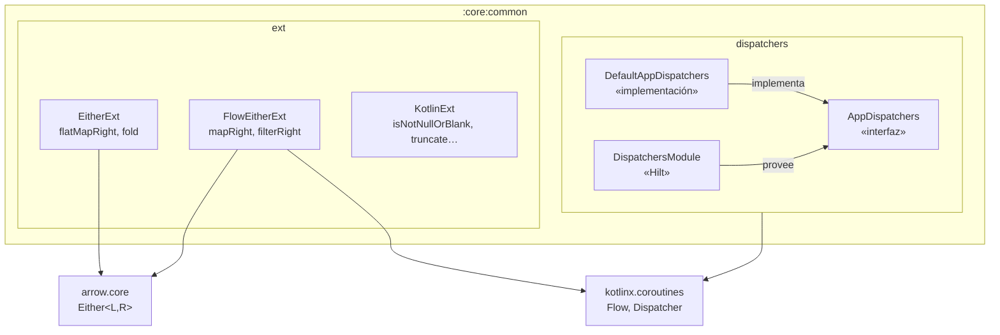

# Diseño interno — `:core:common`

## Diagrama de componentes

## Decisiones de diseño

### AppDispatchers como interfaz

Los `CoroutineDispatcher` se abstraen en la interfaz `AppDispatchers` para permitir su sustitución en tests con `StandardTestDispatcher`. El módulo Hilt `DispatchersModule` provee `DefaultAppDispatchers` en producción.

### Arrow Either en vez de Result<T>

Se eligió Arrow `Either<L, R>` sobre `kotlin.Result<T>` porque:
- El tipo del error es explícito en la firma (`L = DomainError`)
- Las extensiones `flatMapRight`/`fold` mantienen el código libre de `try/catch`
- Arrow `mapLeft` y `getOrElse` están disponibles de fábrica; solo se añaden las que no existen

### Extensiones de flujo separadas

`FlowEitherExt.kt` está separado de `EitherExt.kt` para no arrastrar la dependencia de `kotlinx.coroutines` en contextos donde solo se necesitan operaciones síncronas sobre `Either`.

## Puntos de extensión

- Añadir nuevas extensiones de `Either` (p. ej. `zipRight`) en `EitherExt.kt`
- Añadir nuevas extensiones de `Flow<Either>` en `FlowEitherExt.kt`
- No añadir lógica Android en este módulo; permanece puro Kotlin/JVM
