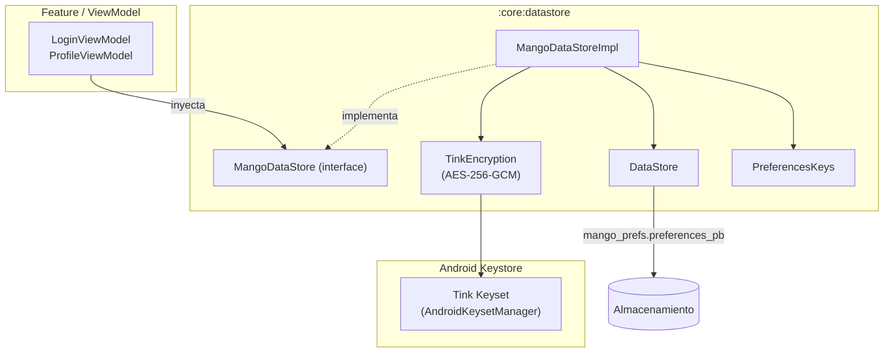

# Diseño interno — `:core:datastore`

## Diagrama de flujo

## Decisiones de diseño

### Cifrado a nivel de valor (Tink) vs cifrado de fichero

DataStore Encrypted Preferences cifra el fichero completo. Aquí se optó por cifrado a nivel de campo con Tink para mayor granularidad:
- Solo los campos sensibles (`accessToken`, `refreshToken`, `userId`) se cifran.
- Las preferencias no sensibles (`theme`, `notificationsEnabled`) se almacenan en texto plano.
- Permite rotar claves de cifrado de sesión sin afectar preferencias.

### `TinkEncryption` como `open class`

`TinkEncryption` es `open class` (no `final`) para permitir que los tests extiendan con una implementación falsa (`FakeTinkEncryption`) que opera en memoria sin inicializar Android Keystore. Esto hace que el módulo sea 100% testeable en JVM.

### `decryptOrNull` — fallo silencioso controlado

Si Tink falla al descifrar un token almacenado (por ejemplo, tras rotación de clave o reinstalación), el campo devuelve `null`. `sessionFlow` emitirá `SessionData` sin tokens → la app trata al usuario como no autenticado → flujo de re-login. El fallo se registra con `Timber.e(...)` para diagnóstico sin revelar datos de sesión.

### Dispatcher IO explícito

`MangoDataStoreImpl` recibe `ioDispatcher: CoroutineDispatcher` en construcción (no `AppDispatchers`) porque DataStore ya gestiona su propio contexto internamente. El dispatcher se usa únicamente para las operaciones `edit { }` que garantizan orden.

## Puntos de extensión

- Añadir campos a `SessionData` (por ejemplo, `expiresAt: Instant`) sin romper el esquema existente — DataStore es más flexible que Room para migraciones de preferencias.
- Implementar `EncryptedDataStore` (cifrado a nivel de fichero) como alternativa a Tink si los requisitos de seguridad cambian.
- Añadir `biometricSessionFlow` con preferencias de tiempo de inactividad para re-autenticación biométrica (ETAPA 2).
