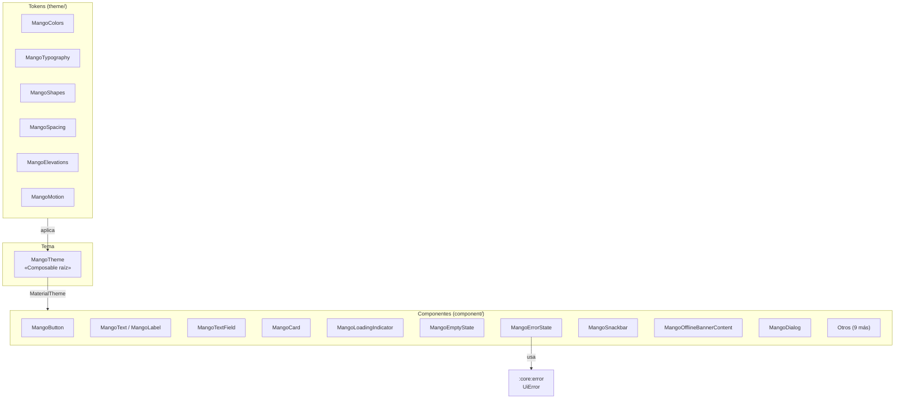

# Diseño interno — `:core:design-system`

## Arquitectura de tokens y componentes

## Decisiones de diseño

### Fuente del sistema (no Playfair Display)

Se usa la fuente del sistema Android (Roboto / sans-serif) a través de `TypographyConfig.kt`. Incorporar un TTF externo requeriría acceso a la CDN de Mango y permisos de licencia; se documentó como decisión en la especificación.

### Material3 aislado en design-system

El test de Konsist `Material3IsolationKonsistTest` garantiza que ningún módulo externo importe `androidx.compose.material3.*`, excepto las excepciones declaradas en `allowedPackages` y `allowedClassesInCoreUi`.

### MangoOfflineBannerContent (stateless)

El componente de UI en design-system es deliberadamente stateless (solo recibe `isOffline: Boolean`). El estado real (observar `ConnectivityManager`) vive en `:core:ui` dentro de `MangoOfflineBanner`. Esto permite usar el componente en previews sin dependencias de plataforma.

### Paparazzi excluido del ciclo estándar

Paparazzi 1.3.5 tiene una incompatibilidad con AGP 9.0.1 (`NoSuchElementException` en `Renderer.configureBuildProperties`). Los snapshot tests se excluyen de `testDebugUnitTest` y solo se ejecutan con `verifyPaparazziDebug`.

## Puntos de extensión

- **Nuevo token**: añadir en el archivo de token correspondiente; `MangoTheme` lo recoge automáticamente si se usa `MaterialTheme.colorScheme.*`
- **Nuevo componente**: crear en `component/`, seguir el patrón `MangoXxx.kt` con previews light/dark
- **Nuevo snapshot test**: crear en `snapshot/` con la clase Paparazzi; se ejecuta por separado
