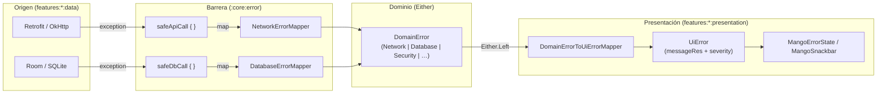

# Diseño interno — `:core:error`

## Diagrama de flujo de errores



## Jerarquía de DomainError

```
DomainError (sealed)
├── Network (sealed)
│   ├── NoConnection(cause)    — sin red / IOException
│   ├── Timeout(cause)         — SocketTimeoutException / TimeoutException
│   ├── Server(code, cause)    — HTTP 5xx
│   ├── Unauthorized(cause)    — HTTP 401
│   ├── Forbidden(cause)       — HTTP 403
│   ├── NotFound(cause)        — HTTP 404
│   └── Parsing(cause)         — SerializationException
├── Database (sealed)
│   ├── ReadFailed(cause)      — error de lectura genérico
│   ├── WriteFailed(cause)     — SQLiteException
│   ├── NotFound(cause)        — elemento no hallado en BD
│   └── IntegrityViolation(c)  — SQLiteConstraintException
├── Security (sealed)
│   ├── BiometricUnavailable(c)
│   ├── BiometricLockout(c)
│   ├── RootDetected(c)
│   ├── IntegrityFailed(c)
│   └── SessionExpired(c)
├── Validation(field, messageRes)
└── Unknown(cause)
```

## Decisiones de diseño

### Excepciones solo en la barrera

`safeApiCall` y `safeDbCall` son los únicos puntos del sistema que usan `try/catch (e: Throwable)`. Ambos están anotados con `@Suppress("TooGenericExceptionCaught")` y re-lanzan `CancellationException` para preservar la cooperación de corrutinas.

### Ordering en NetworkErrorMapper

`SocketTimeoutException` hereda de `IOException`. Por eso se evalúa **antes** en el `when`. Si se invirtiese el orden, todos los timeouts se clasificarían como `NoConnection`.

### Android stubs en unit tests

Los constructores de `SQLiteException(String)` en los stubs JVM del SDK Android no preservan el mensaje. Por eso `DatabaseErrorMapper` no distingue lecturas de escrituras por el mensaje de la excepción — siempre mapea `SQLiteException` a `WriteFailed` y el caso genérico a `ReadFailed`.

## Puntos de extensión

- Añadir nuevas subclases a `DomainError` siguiendo la jerarquía sealed
- Añadir el caso correspondiente en `DomainErrorToUiErrorMapper` (el `when` es exhaustivo)
- Añadir la cadena localizada `R.string.error_<dominio>_<caso>` en `res/values/strings.xml`
- Si el nuevo error requiere mapeo desde excepción, añadir la rama en el mapper correspondiente
