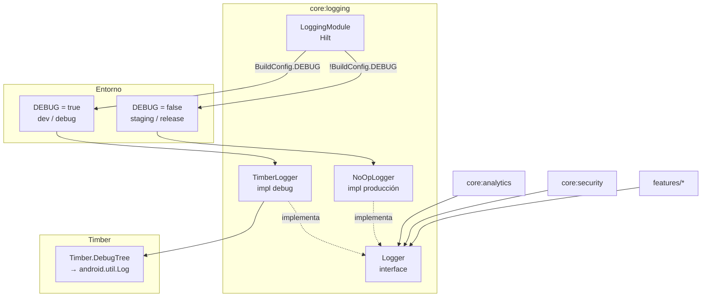

# Diseño — `:core:logging`

## Diagrama de arquitectura

## Decisiones de diseño

### Un Logger, dos árboles de decisión

El patrón es simple: `BuildConfig.DEBUG` en `LoggingModule` determina una vez, en tiempo de inicio de la app, qué implementación usa toda la jerarquía de Hilt. Esto es más explícito y seguro que depender de ProGuard para eliminar llamadas de log en producción.

### Timber como backend de debug

`TimberLogger` delega en Timber porque Timber ofrece:
- Auto-tagging (clase + línea) via `DebugTree`
- Trees intercambiables (útil para test en CI)
- Integración sin boilerplate

`TimberLogger.init` planta `Timber.DebugTree` solo si aún no hay ningún árbol, evitando duplicados cuando múltiples módulos inicializan el Logger.

### NoOpLogger: supresión en la fuente

En producción, todos los métodos son `= Unit`. Kotlin/JVM elimina los cuerpos vacíos eficientemente; no se generan llamadas a `android.util.Log`. Esto garantiza:
- Cero exposición de strings internos en builds de producción
- Cero overhead de formato de strings
- Cumplimiento de auditorías de seguridad sin configuración adicional

### `tag` como parámetro explícito

Cada llamada pasa el `tag` explícitamente (constante `TAG` en companion object). Esto permite filtrar logs en logcat por módulo durante el desarrollo sin necesidad de Timber's automatic tag inference (que usa reflection).

## Puntos de extensión

- **CrashlyticsTree**: añadir un árbol que envía `warn`/`error` a Crashlytics en staging (sin exponer logs en producción pero con observabilidad). Crear `CrashlyticsLogger` que extiende `Logger` e inyecta `FirebaseCrashlytics`.
- **FileLogger**: en entornos de QA, añadir un árbol que escribe a fichero para análisis post-sesión.
