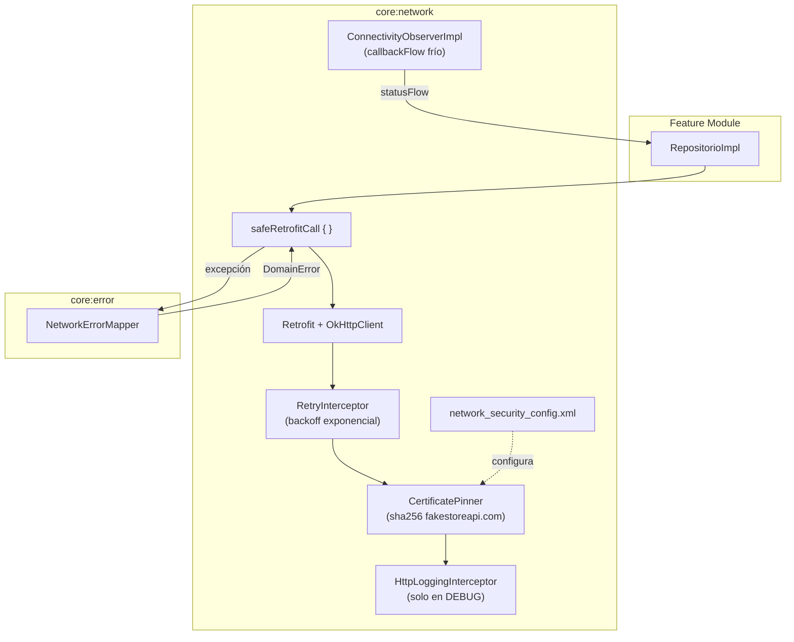

# Diseño interno — `:core:network`

## Diagrama de flujo

## Decisiones de diseño

### `callbackFlow` frío en `ConnectivityObserverImpl`

La implementación usa `callbackFlow { ... }` sin `shareIn`. Cada colector recibe su propio `NetworkCallback` registrado y desregistrado con `awaitClose`. Esto mantiene la testabilidad (sin estado compartido entre tests) a costa de registrar múltiples callbacks si hay varios colectores activos. En la app, el único colector activo suele ser `MangoOfflineBanner` en el nivel de `MainActivity`.

### `safeRetrofitCall` vs `safeApiCall` de `:core:error`

`:core:error` provee `safeApiCall` que usa `NetworkErrorMapper` directamente. `safeRetrofitCall` en `:core:network` añade mapeo explícito de `retrofit2.HttpException` por código HTTP antes de delegar al mapper, lo que evita parsear el mensaje de la excepción para extraer el código.

### RetryInterceptor — no reintenta POST sin `Idempotency-Key`

Los métodos POST son potencialmente no idempotentes. El interceptor solo reintenta si el request es GET/PUT/DELETE, o si el header `Idempotency-Key` está presente. La política de reintentos (máx. 3, backoff 500ms base, ±300ms jitter) sigue §7.7 del prompt maestro.

### Certificate Pinning en dos niveles

1. **`network_security_config.xml`** (Android NSC) — bloquea en el sistema operativo.
2. **`CertificatePinner` de OkHttp** — segunda capa en la app, independiente del sistema.

El pin de backup (`sha256/AAAA...`) es un placeholder que debe reemplazarse con el pin del certificado de respaldo real antes de la publicación en producción.

## Puntos de extensión

- Implementar `NetworkErrorReporter` con Firebase Crashlytics en `:core:analytics` y enlazarlo vía `@Binds` sobrescribiendo el binding de `NoOpNetworkErrorReporter`.
- Cambiar `BASE_URL` por flavor en `build.gradle.kts` → preparado con tres flavors: `dev`, `staging`, `prod`.
- Añadir autenticación: crear `AuthInterceptor` en `:features:auth:data` que intercepte con token de `MangoDataStore`.
