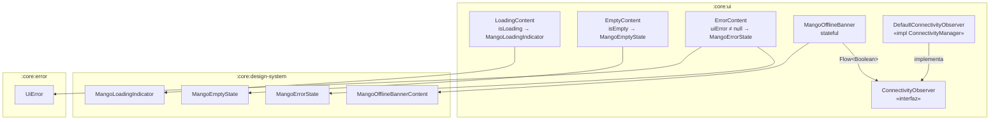

# Diseño interno — `:core:ui`

## Diagrama de composables de estado

## Decisiones de diseño

### ConnectivityObserver como interfaz

`ConnectivityObserver` es una interfaz para permitir tests unitarios: se inyecta una implementación falsa (`FakeConnectivityObserver`) en lugar de `DefaultConnectivityObserver` que necesita Android.

### Flow.map en `remember`

El operador `.map { !it }` en `MangoOfflineBanner` está dentro de `remember(connectivityObserver)` para evitar la violación lint `FlowOperatorInvokedInComposition`, que lanzaría un error si el operador se invocara directamente en el cuerpo de composición.

### MangoOfflineBanner vs MangoOfflineBannerContent

| | `MangoOfflineBannerContent` (`:core:design-system`) | `MangoOfflineBanner` (`:core:ui`) |
|-|---|---|
| Estado | Stateless (`isOffline: Boolean`) | Stateful (observa `ConnectivityManager`) |
| Testeable | Sí (snapshot, sin Android) | Vía fake `ConnectivityObserver` |
| Uso | Previews, tests de snapshot | Producción |

### Permisos Android

`core/ui/src/main/AndroidManifest.xml` declara `ACCESS_NETWORK_STATE` requerido por `ConnectivityManager.registerNetworkCallback`. Sin este permiso, el lint `MissingPermission` bloquearía la compilación.

## Puntos de extensión

- Añadir nuevos composables de estado (`RefreshContent`, `PaginationContent`) siguiendo el patrón de `LoadingContent`
- Añadir modificadores en `modifier/` para efectos visuales reutilizables
- Las anotaciones de preview `@MangoPreview`, `@PreviewLightDark`, `@PreviewFontScale` pueden reutilizarse en cualquier módulo de features
