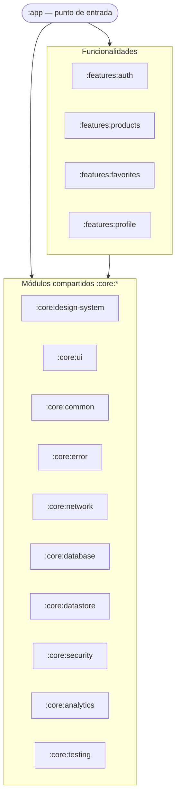
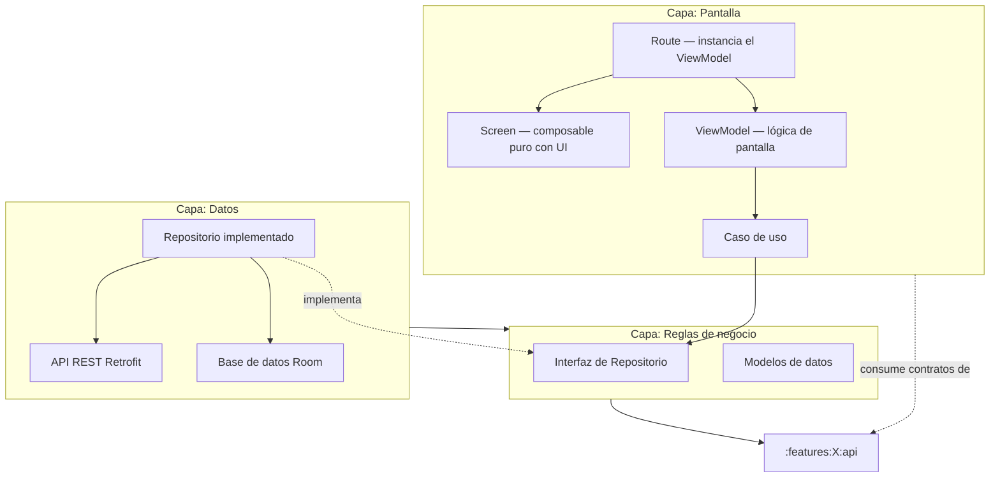

# Arquitectura de la aplicación

Este documento explica cómo está organizado el código de Mango Fake Store: por qué está dividido en piezas separadas, qué hace cada pieza y cómo se relacionan entre sí.

## Módulos: las piezas del código

La app está dividida en módulos independientes. Hay dos grupos principales:

### Módulos de funcionalidades (`:features:*`)

Cada pantalla o flujo de la app tiene su propio conjunto de módulos:

| Funcionalidad | Qué contiene |
|---|---|
| **auth** | Pantalla de selección de usuario / login |
| **products** | Listado de productos de la tienda |
| **favorites** | Lista de productos marcados como favoritos |
| **profile** | Perfil del usuario con sus datos y botón de cerrar sesión |

Cada funcionalidad se divide a su vez en cuatro capas:

```
features/auth/
├── api/          ← Lo que otras funcionalidades pueden usar de auth
├── domain/       ← Las reglas: "¿qué ocurre al iniciar sesión?"
├── data/         ← Cómo se guarda la sesión y se llama a la API
└── presentation/ ← La pantalla que ve el usuario
```

### Módulos compartidos (`:core:*`)

Son herramientas que usan todas las funcionalidades. No tienen pantallas propias.

| Módulo | Para qué sirve |
|---|---|
| `:core:design-system` | Botones, colores, tipografía y otros componentes visuales de la marca Mango |
| `:core:ui` | Componentes auxiliares de pantalla: pantalla de carga, pantalla de error, banner sin internet |
| `:core:network` | Configuración de las llamadas a internet (reintentos, seguridad TLS, detección de red) |
| `:core:database` | Base de datos local del teléfono, cifrada con contraseña |
| `:core:datastore` | Almacenamiento seguro de la sesión del usuario |
| `:core:error` | Cómo se clasifican y muestran los errores al usuario |
| `:core:analytics` | Registro de eventos (Firebase: qué productos se ven, cuándo falla algo) |
| `:core:security` | Detección de dispositivos comprometidos (root, Frida), protección de pantalla |
| `:core:common` | Utilidades de Kotlin reutilizables en toda la app |
| `:core:testing` | Herramientas para escribir y ejecutar pruebas automáticas |

---

## Diagrama global de módulos



`:app` es el módulo raíz: ensambla todo y arranca la aplicación. Las funcionalidades usan los módulos compartidos pero **nunca** se usan entre sí directamente (para eso existe `:features:X:api`).

---

## Cómo fluye una acción del usuario

Ejemplo: el usuario pulsa "Añadir a favoritos" en la lista de productos.

```
Usuario toca el botón
        ↓
Pantalla (ProductosScreen) notifica al ViewModel
        ↓
ViewModel llama al caso de uso (ToggleFavorito)
        ↓
ToggleFavorito habla con el Repositorio (interfaz)
        ↓
RepositoryImpl guarda en Room (base de datos local)
        ↓
El resultado sube de vuelta: RepositoryImpl → UseCase → ViewModel → Pantalla
        ↓
La pantalla muestra el corazón relleno ❤️
```

En ningún paso la pantalla habla directamente con la base de datos, ni la base de datos sabe cómo se ve la pantalla.

---

## Diagrama de capas por funcionalidad



---

## Reglas de dependencia

Las capas tienen reglas estrictas sobre quién puede hablar con quién. Esto evita que el código se vuelva un enredo con el tiempo.

**Regla principal**: las dependencias siempre van hacia el interior (hacia `domain`). La pantalla conoce las reglas de negocio; las reglas de negocio no saben nada de pantallas.

| Si eres... | Puedes usar... | No puedes usar... |
|---|---|---|
| La pantalla (`presentation`) | `domain`, `api`, `core:design-system`, `core:ui`, `core:analytics` | `data` de cualquier feature |
| Las reglas (`domain`) | `core:common`, `core:error` | Nada de Android, nada de pantallas |
| Los datos (`data`) | `domain`, `core:network`, `core:database`, `core:datastore` | `presentation` |
| `:app` | `presentation` de cada feature, todos los `core:*` | `data` o `domain` directamente |

---

## Manejo de errores

Todos los errores siguen el mismo camino:

1. La API o la base de datos lanza una excepción → `safeApiCall` / `safeDbCall` la captura y la convierte en `DomainError` (tipo concreto: sin red, servidor caído, no encontrado, etc.).
2. El caso de uso devuelve `Either<DomainError, Resultado>` — nunca lanza excepciones.
3. El ViewModel mapea `DomainError` a `UiError` con un mensaje localizado en el idioma del teléfono.
4. La pantalla muestra ese `UiError` a través de `MangoErrorState` o `MangoSnackbar`.

La pantalla **nunca** recibe un `Throwable` ni un mensaje de error en inglés del servidor.

---

## Automatización de la calidad

| Herramienta | Qué verifica |
|---|---|
| **Detekt** | Estilo de código, complejidad, imports, nombres |
| **Kover** | Cobertura de tests por módulo |
| **SonarCloud** | Quality gate centralizado en cada PR |
| **Konsist** (`:core:testing`) | Que las reglas de arquitectura se cumplen automáticamente en cada build |

---

## Pipelines de CI/CD

| Cuándo | Qué ocurre |
|---|---|
| Abres un Pull Request | Lint + tests unitarios + cobertura + build debug + SonarCloud |
| Haces merge a `develop` | Todo lo anterior + Firebase Test Lab (dispositivos reales) + distribución interna QA |
| Creas un tag `v*` | Build de release firmado + GitHub Release |

Documentación operacional completa: [`docs/ci-cd.md`](ci-cd.md).
