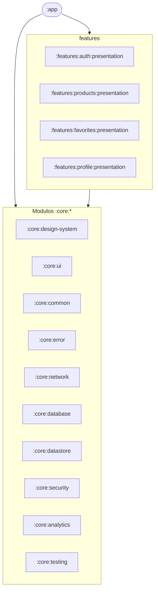
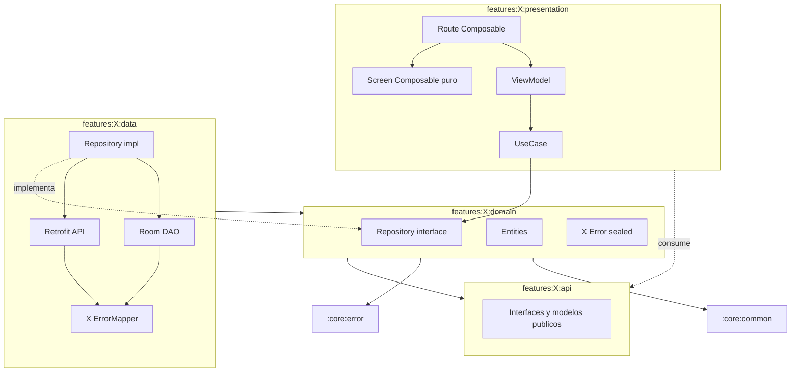

# Arquitectura del proyecto Mango Fake Store

Este documento es el mapa de capas y módulos del proyecto. Se mantiene sincronizado con §3
y §4 del prompt maestro (`prompt.txt` del proyecto externo). Cualquier desviación se
documenta en un ADR.

## Visión general

La aplicación sigue **Clean Architecture estricta + MVVM** con tres capas separadas por
feature (`data`, `domain`, `presentation`) y un conjunto transversal de módulos `:core:*`.
Las dependencias apuntan hacia el dominio: `data` y `presentation` nunca se conocen entre
sí; ambas dependen de `domain`. La comunicación entre módulos pasa exclusivamente por
interfaces publicadas en `:features:*:api`.

## Diagrama global de módulos



## Diagrama de capas por feature



## Matriz de dependencias permitidas

| Origen ↓ \\ Destino → | `:app` | `features:*:presentation` | `features:*:data` | `features:*:domain` | `features:*:api` | `:core:design-system` | `:core:ui` | `:core:common` | `:core:error` | `:core:network` | `:core:database` | `:core:datastore` | `:core:analytics` | `:core:security` | `:core:testing` |
|---|---|---|---|---|---|---|---|---|---|---|---|---|---|---|---|
| `:app` | — | ✅ | ❌ | ❌ | ✅ | ✅ | ✅ | ✅ | ✅ | ❌ | ❌ | ❌ | ✅ | ✅ | test |
| `features:*:presentation` | ❌ | — | ❌ | ✅ | ✅ | ✅ | ✅ | ✅ | ✅ | ❌ | ❌ | ❌ | ✅ | ❌ | test |
| `features:*:data` | ❌ | ❌ | — | ✅ | ✅ | ❌ | ❌ | ✅ | ✅ | ✅ | ✅ | ✅ | ✅ | ✅ | test |
| `features:*:domain` | ❌ | ❌ | ❌ | — | ✅ | ❌ | ❌ | ✅ | ✅ | ❌ | ❌ | ❌ | ❌ | ❌ | test |
| `features:*:api` | ❌ | ❌ | ❌ | ❌ | — | ❌ | ❌ | ✅ | ✅ | ❌ | ❌ | ❌ | ❌ | ❌ | test |
| `:core:design-system` | ❌ | ❌ | ❌ | ❌ | ❌ | — | ✅ | ✅ | ✅ | ❌ | ❌ | ❌ | ❌ | ❌ | test |
| `:core:ui` | ❌ | ❌ | ❌ | ❌ | ❌ | ✅ | — | ✅ | ✅ | ❌ | ❌ | ❌ | ❌ | ❌ | test |
| `:core:analytics` | ❌ | ❌ | ❌ | ❌ | ❌ | ❌ | ❌ | ✅ | ✅ | ❌ | ❌ | ❌ | — | ❌ | test |
| `:core:network` | ❌ | ❌ | ❌ | ❌ | ❌ | ❌ | ❌ | ✅ | ✅ | — | ❌ | ❌ | ✅ | ❌ | test |
| `:core:database` | ❌ | ❌ | ❌ | ❌ | ❌ | ❌ | ❌ | ✅ | ✅ | ❌ | — | ❌ | ✅ | ✅ | test |
| `:core:datastore` | ❌ | ❌ | ❌ | ❌ | ❌ | ❌ | ❌ | ✅ | ✅ | ❌ | ❌ | — | ❌ | ✅ | test |
| `:core:security` | ❌ | ❌ | ❌ | ❌ | ❌ | ❌ | ❌ | ✅ | ✅ | ❌ | ❌ | ❌ | ❌ | — | test |
| `:core:common` | ❌ | ❌ | ❌ | ❌ | ❌ | ❌ | ❌ | — | ❌ | ❌ | ❌ | ❌ | ❌ | ❌ | test |
| `:core:error` | ❌ | ❌ | ❌ | ❌ | ❌ | ❌ | ❌ | ✅ | — | ❌ | ❌ | ❌ | ❌ | ❌ | test |
| `:core:testing` | ❌ | ❌ | ❌ | ❌ | ❌ | ❌ | ❌ | ✅ | ✅ | ❌ | ❌ | ❌ | ❌ | ❌ | — |

Leyenda:
- ✅ = puede depender.
- ❌ = prohibido por diseño; introducirla rompe Clean Architecture.
- `test` = únicamente como `testImplementation`/`testFixtures`.
- "—" = mismo módulo.

Esta matriz se verifica con Konsist (`:core:testing`) y con el skill `validar-arquitectura`.

## Responsabilidades por módulo

### `:app`

Ensambla la aplicación, declara `Application` con Hilt, aloja el `NavHost` raíz, configura
`MangoOfflineBanner` global y `CoroutineExceptionHandler` raíz. No contiene lógica de feature.

### Modulos `:core:*`

| Módulo | Capa Android | Responsabilidad |
|---|---|---|
| `:core:common` | Kotlin puro | Dispatchers, helpers `Either`, extensions Kotlin transversales. |
| `:core:error` | Kotlin puro | `DomainError` sealed, `UiError`, `ErrorMapper` base, `safeApiCall`/`safeDbCall`, contratos de reportería. |
| `:core:design-system` | Android + Compose | Tokens (colores, tipografía, espaciado, formas, motion) y componentes Mango (`MangoButton`, `MangoErrorState`, etc.). |
| `:core:ui` | Android + Compose | Utilidades Compose: modifiers, extensions, previews, composables auxiliares (`LoadingContent`, `EmptyContent`, `ErrorContent`). |
| `:core:network` | Android | OkHttp/Retrofit base, interceptors, certificate pinning, `NetworkErrorMapper`, `ConnectivityObserver`, retry con backoff. |
| `:core:database` | Android | Room base, encriptación SQLCipher, migrations, `DatabaseErrorMapper`. |
| `:core:datastore` | Android | DataStore Preferences cifrado para tokens/preferencias. |
| `:core:analytics` | Android | Interfaz `Telemetry`, `EventTracker`, impls Firebase y Console. |
| `:core:security` | Android | Biometría, anti-screenshot, root detection, secret obfuscation. |
| `:core:testing` | Kotlin puro | Utilidades de test (fakes, rules, dispatchers test, builders, tests Konsist). |

### Modulos `:features:*`

Cada feature (`auth`, `products`, `favorites`, `profile`) tiene cuatro submódulos:

| Submódulo | Capa Android | Responsabilidad |
|---|---|---|
| `:features:X:api` | Kotlin puro | Contratos públicos (interfaces de UseCase y modelos públicos). |
| `:features:X:domain` | Kotlin puro | Casos de uso, entidades, errores específicos (`XError`), interfaz de repositorio. |
| `:features:X:data` | Android + Hilt | Repositorio impl, Retrofit/Room, DTOs/Entities (internal), mappers, `XErrorMapper`. |
| `:features:X:presentation` | Android + Compose + Hilt | ViewModels, `UiState`/`UiEvent`/`UiEffect`, Composables `Route`+`Screen`, previews. |

## Convention plugins

El módulo `build-logic/` expone 8 convention plugins que centralizan la configuración Gradle:

- `mango.android.application` (para `:app`)
- `mango.android.library` (para módulos Android library)
- `mango.android.feature` (atajo para presentation: library + compose + hilt)
- `mango.kotlin.library` (para módulos Kotlin puros)
- `mango.android.hilt` (añade Hilt + KSP)
- `mango.android.compose` (habilita Compose y enlaza el BOM)
- `mango.detekt` (Detekt con config compartida)
- `mango.kover` (Kover por módulo, agregado en root)

## Manejo de errores transversal

Detalle completo en `docs/manejo-errores.md` (pendiente) y en el ADR `docs/adr/0001-manejo-errores.md`.

Resumen: toda función pública de `domain` y de `data` retorna `Either<DomainError, T>` (Arrow).
Las excepciones se capturan exclusivamente en `safeApiCall`/`safeDbCall` o en `XErrorMapper`
del módulo. La UI nunca recibe `Throwable` ni `DomainError`; recibe `UiError` con `messageRes`
localizado.

## Convenciones de paquetes

```
com.mango.fakestore
├── app                                  -> :app
├── core
│   ├── analytics
│   ├── common
│   ├── database
│   ├── datastore
│   ├── designsystem                     -> :core:design-system
│   ├── error
│   ├── network
│   ├── security
│   ├── testing
│   └── ui
└── features
    ├── auth
    │   ├── api
    │   ├── data
    │   ├── domain
    │   └── presentation
    ├── favorites
    │   └── …
    ├── products
    │   └── …
    └── profile
        └── …
```

## Cómo extender la arquitectura

1. **Añadir un feature nuevo**: invocar `crear-modulo nombre=<X> tipo=feature` desde una sesión
   de Claude Code; registrar los 4 submódulos en `settings.gradle.kts`; añadir entrada en esta
   matriz si introduce dependencias nuevas.
2. **Añadir un módulo `:core:*`**: invocar `crear-modulo nombre=<X> tipo=core` y justificar en
   un ADR la necesidad (qué problema transversal resuelve).
3. **Modificar la matriz de dependencias**: requiere ADR y enmienda en `prompt.txt` +
   constitución + esta sección.

## CI/CD (ETAPA 9)

Los pipelines de automatización viven en `.github/workflows/`:

| Workflow | Trigger | Propósito |
|---|---|---|
| `pr.yml` | Pull Request → `develop`/`main` | Detekt + ktlint + tests unitarios + Kover + assembleDevDebug + SonarCloud (opcional) |
| `main.yml` | Push a `develop` | Todo lo de `pr.yml` + Firebase Test Lab + Firebase App Distribution (grupo `qa-internal`) |
| `release.yml` | Push de tag `v*` | `bundleProdRelease` firmado + Google Play Internal Testing + mapping Crashlytics + GitHub Release |
| `azure-pipelines.yml` | Push/PR opcional | Espejo en Azure Pipelines (referencia, no pipeline principal) |

Documentación operacional completa: [`docs/ci-cd.md`](ci-cd.md).

## Mantenimiento

- Este documento se actualiza al cerrar cada ETAPA del prompt maestro (§14).
- Cualquier desviación entre lo documentado y el código se reporta como bug.
- Konsist es la red de seguridad automatizada; este documento es la verdad humana.
