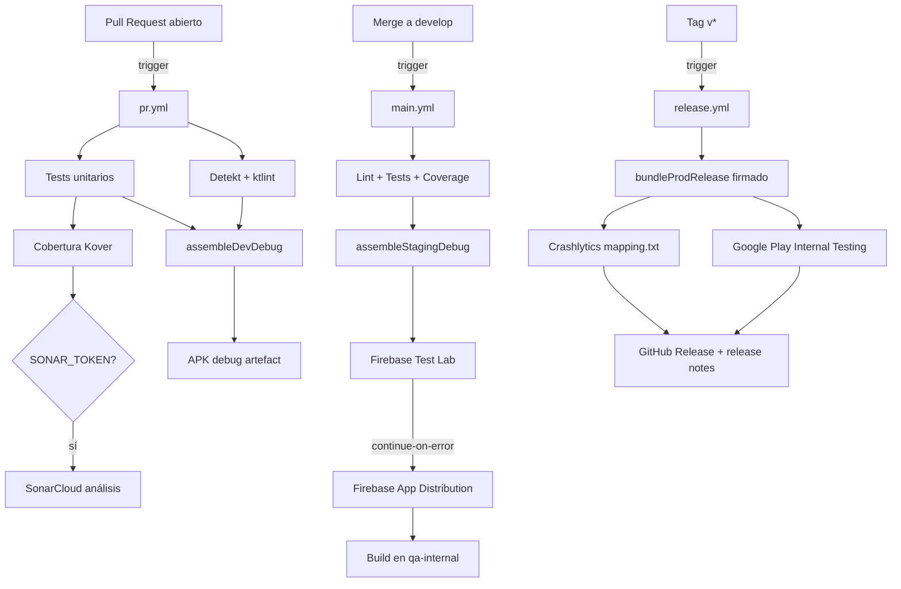

# CI/CD — Guía operacional

**Última actualización**: 2026-05-12
**Stack**: GitHub Actions (gratuito para repos públicos) + Firebase Test Lab + Firebase App Distribution + Gradle Play Publisher + SonarCloud (opcional)

---

## Stack de CI/CD activo

| Herramienta | Propósito | Tier |
|---|---|---|
| **GitHub Actions** | Pipeline principal (PR, main, release) | Gratuito ilimitado (repo público) |
| **Firebase Test Lab** | Pruebas instrumentadas en dispositivos reales | Cuota diaria gratuita (5 físicos / 10 virtuales) |
| **Firebase App Distribution** | Distribución interna a QA | Gratuito ilimitado |
| **Gradle Play Publisher (GPP)** | Subida de AAB a Google Play Internal Testing | Gratuito (plugin open source) |
| **SonarCloud** | Quality gate centralizado en la nube | Gratuito para repos públicos |
| **`act`** | Ejecución local de workflows de GitHub Actions | Open source (gratuito) |

---

## Mapa de workflows



---

## Secretos requeridos

Configurar en: `GitHub → Settings → Secrets and variables → Actions → New repository secret`

| Nombre del secreto | Descripción | Cómo generarlo | Usado en |
|---|---|---|---|
| `FIREBASE_GOOGLE_SERVICES_JSON` | Contenido JSON de `google-services.json` | Firebase Console → Project settings → Download | pr.yml, main.yml, release.yml |
| `FIREBASE_SERVICE_ACCOUNT_JSON` | Service account de Firebase | Firebase Console → Project settings → Service accounts → Generate private key | main.yml, release.yml |
| `KEYSTORE_B64` | Keystore de producción codificado en Base64 | `base64 -i release.keystore \| tr -d '\n'` | release.yml |
| `KEYSTORE_PASSWORD` | Contraseña del keystore | La que usaste al crear el keystore | release.yml |
| `KEY_ALIAS` | Alias de la clave dentro del keystore | El alias que definiste al crear la clave | release.yml |
| `KEY_PASSWORD` | Contraseña de la clave | La que usaste al crear la clave | release.yml |
| `GOOGLE_PLAY_SERVICE_ACCOUNT_JSON` | Service account de Google Play API | Google Play Console → Setup → API access → Create service account | release.yml |
| `SONAR_TOKEN` | Token de autenticación de SonarCloud | sonarcloud.io → My Account → Security → Generate Tokens | pr.yml, main.yml (opcional) |

### Variables de entorno (no secretos)

Configurar en: `GitHub → Settings → Secrets and variables → Actions → Variables`

| Variable | Descripción | Ejemplo |
|---|---|---|
| `FIREBASE_APP_ID` | ID de la app en Firebase | `1:123456789:android:abc123def456` |
| `FIREBASE_TEST_RESULTS_BUCKET` | Bucket de GCS para resultados de Test Lab | `mi-proyecto-test-results` |

---

## Rotación de secretos

### Rotar `FIREBASE_GOOGLE_SERVICES_JSON`

1. Ir a Firebase Console → Project settings → General → Your apps → Mango Fake Store Android
2. Hacer clic en "Download google-services.json"
3. Actualizar el secret en GitHub: Settings → Secrets → `FIREBASE_GOOGLE_SERVICES_JSON` → Update
4. Verificar: hacer push a una rama con PR y confirmar que el pipeline de PR pasa

### Rotar `FIREBASE_SERVICE_ACCOUNT_JSON`

1. Ir a Firebase Console → Project settings → Service accounts
2. Hacer clic en "Generate new private key" → confirmar
3. Codificar el JSON en Base64: NO necesario (se usa el JSON directamente)
4. Actualizar el secret en GitHub: `FIREBASE_SERVICE_ACCOUNT_JSON` → Update
5. Revocar el service account anterior en Google Cloud Console → IAM → Service accounts

### Rotar `KEYSTORE_B64` (keystore expirado o comprometido)

> ⚠️ Si el keystore cambia, **TODAS las versiones futuras de la app deben firmarse con el nuevo keystore**. Las versiones ya publicadas en Google Play **no se pueden actualizar** con un keystore diferente. Contacta al equipo de seguridad antes de rotar.

1. Generar nuevo keystore: `keytool -genkeypair -v -keystore release-new.keystore -alias mango-release -keyalg RSA -keysize 2048 -validity 10000`
2. Codificar: `base64 -i release-new.keystore | tr -d '\n' > keystore_b64.txt`
3. Actualizar los 4 secrets: `KEYSTORE_B64`, `KEYSTORE_PASSWORD`, `KEY_ALIAS`, `KEY_PASSWORD`
4. Probar con un release de prueba antes de subir a producción

### Rotar `GOOGLE_PLAY_SERVICE_ACCOUNT_JSON`

1. Google Play Console → Setup → API access → Ver en Google Cloud Console
2. Seleccionar la cuenta de servicio → Claves → Añadir clave → JSON
3. Actualizar `GOOGLE_PLAY_SERVICE_ACCOUNT_JSON` en GitHub Secrets
4. Revocar la clave anterior en Google Cloud Console

### Rotar `SONAR_TOKEN`

1. sonarcloud.io → My Account → Security → Revocar token existente
2. Generar nuevo token con el mismo nombre
3. Actualizar `SONAR_TOKEN` en GitHub Secrets

---

## Ejecución local con `act`

### Instalar `act`

```bash
# macOS
brew install act

# Linux
curl -s https://raw.githubusercontent.com/nektos/act/master/install.sh | sudo bash
```

### Crear archivo de secretos locales

```bash
# En repository/android-fake-store-app/
cat > .secrets.local << 'EOF'
FIREBASE_GOOGLE_SERVICES_JSON={"project_info":{"project_id":"..."},...}
SONAR_TOKEN=tu_token_opcional
EOF
```

> ⚠️ `.secrets.local` está en `.gitignore` — **nunca lo commitees**.

### Ejecutar pipelines localmente

```bash
cd repository/android-fake-store-app

# Simular el pipeline de PR (lint + test + build)
act pull_request --secret-file .secrets.local

# Solo el job de lint
act pull_request -j lint --secret-file .secrets.local

# Solo el job de tests
act pull_request -j test --secret-file .secrets.local

# Simular push a develop
act push --secret-file .secrets.local

# Ver todos los workflows disponibles
act --list
```

---

## Correspondencia con otras plataformas de CI/CD

### Bitrise → GitHub Actions

| Concepto Bitrise | Equivalente GitHub Actions |
|---|---|
| Workflow | Job (`jobs.<job-id>`) |
| Step | Step (`steps[*]`) |
| Trigger Map | `on:` (push/pull_request/tags) |
| Secret Environment Variables | `secrets.<NAME>` |
| Artifact Upload | `actions/upload-artifact@v4` |
| Cache | `actions/cache@v4` |
| Stack (p. ej. `linux-docker-android`) | `runs-on: ubuntu-latest` |
| `Android Build` step | `./gradlew assembleDebug` |
| `Android Unit Test` step | `./gradlew testDebugUnitTest` |
| `Firebase App Distribution` step | `firebase appdistribution:distribute ...` |
| `Deploy to Google Play` step | `./gradlew publishReleaseBundle` (GPP) |
| Concurrency (abort duplicate) | `concurrency: group: ...` |

Si la empresa exige Bitrise, ver `azure-pipelines.yml` como referencia de cómo mapear los pasos, y adaptar la misma lógica a Bitrise workflows.

---

## Troubleshooting

### `No matching client found for package name`

**Causa**: `google-services.json` no incluye la variante de flavor (`.dev`, `.staging`).
**Solución**: Asegurarse de que el secret `FIREBASE_GOOGLE_SERVICES_JSON` incluye entradas para `com.example.fakestoreapp`, `com.example.fakestoreapp.dev` y `com.example.fakestoreapp.staging`.

### `Unable to load service account credential file`

**Causa**: El secret `GOOGLE_PLAY_SERVICE_ACCOUNT_JSON` no se está escribiendo correctamente al disco.
**Solución**: Verificar que el valor del secret es JSON válido (sin codificación Base64). Inspeccionar con `echo "$GOOGLE_PLAY_SERVICE_ACCOUNT_JSON" | python3 -m json.tool`.

### `Firebase Test Lab: quota exceeded`

**Causa**: Se agotó la cuota diaria gratuita (5 ejecuciones en dispositivos físicos).
**Solución**: El job usa `continue-on-error: true`, así que el pipeline continúa. Esperar a que la cuota se restablezca al día siguiente (UTC 00:00).

### El pipeline de PR tarda más de 15 minutos

**Causa probable**: Caché de Gradle invalidada (cambio en `libs.versions.toml` o `build.gradle.kts`).
**Solución**: Normal tras un cambio de dependencias. La siguiente ejecución usará el nuevo caché. Si ocurre sistemáticamente, revisar si hay tareas innecesariamente incrementales.

### `bundleProdRelease FAILED: signingConfig storeFile is not set`

**Causa**: La variable de entorno `KEYSTORE_PATH` no llega al proceso de Gradle.
**Solución**: Verificar que el step de "Decodificar keystore" se ejecutó correctamente y que las variables de entorno están definidas en el job correcto (no en `env:` global).

### `appdistribution:distribute: Firebase App not found`

**Causa**: `FIREBASE_APP_ID` no está configurado como variable de entorno del repositorio.
**Solución**: GitHub → Settings → Secrets and variables → Actions → Variables → `FIREBASE_APP_ID`.

### `SonarCloud: organization not found`

**Causa**: `sonar-project.properties` tiene el `sonar.organization` incorrecto.
**Solución**: Verificar en sonarcloud.io → My Organizations → nombre exacto de la organización. Debe coincidir con el campo `sonar.organization` en `sonar-project.properties`.
