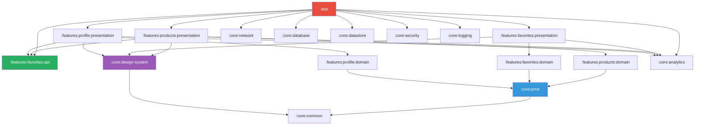
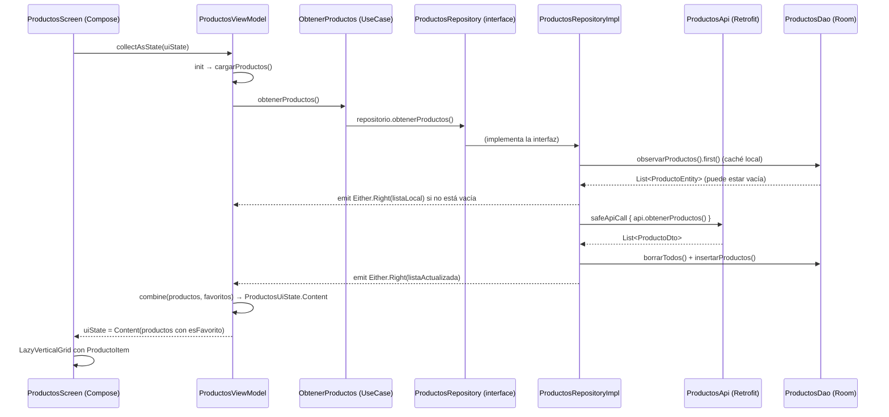

# Guía técnica de la app — Mango Fake Store

Documento de referencia para entrevistas técnicas. Cubre **toda** la arquitectura, patrones,
decisiones de diseño y preguntas frecuentes con ejemplos de código real.

---

## Tabla de contenidos

1. [Visión del producto y flujos](#1-visión-del-producto-y-flujos)
2. [Mapa de módulos y dependencias](#2-mapa-de-módulos-y-dependencias)
3. [Clean Architecture + MVVM](#3-clean-architecture--mvvm)
4. [Build Flavors (dev / staging / prod)](#4-build-flavors-dev--staging--prod)
5. [Estados de UI por pantalla](#5-estados-de-ui-por-pantalla)
6. [Manejo de errores tipado](#6-manejo-de-errores-tipado)
7. [Inyección de dependencias con Hilt](#7-inyección-de-dependencias-con-hilt)
8. [Reactive programming: Flow y corrutinas](#8-reactive-programming-flow-y-corrutinas)
9. [Persistencia: Room + SQLCipher y DataStore + Tink](#9-persistencia-room--sqlcipher-y-datastore--tink)
10. [Red: Retrofit + OkHttp](#10-red-retrofit--okhttp)
11. [Seguridad en capas](#11-seguridad-en-capas)
12. [Tests: unit, UI y de arquitectura](#12-tests-unit-ui-y-de-arquitectura)
13. [Observabilidad con Firebase](#13-observabilidad-con-firebase)
14. [CI/CD con GitHub Actions](#14-cicd-con-github-actions)
15. [Design System Mango](#15-design-system-mango)
16. [ADRs: decisiones de arquitectura](#16-adrs-decisiones-de-arquitectura)
17. [Exportar a PDF](#17-exportar-a-pdf)
18. [Preguntas frecuentes de entrevista](#18-preguntas-frecuentes-de-entrevista)

---

## 1. Visión del producto y flujos

**Mango Fake Store** es una app Android de catálogo de moda que consume la API pública
[fakestoreapi.com](https://fakestoreapi.com). Sirve como prueba técnica de nivel profesional.

### Funcionalidades principales

| Pantalla | Función |
|----------|---------|
| Productos | Catálogo en grid 2 columnas; toggle de favorito por item |
| Favoritos | Lista de productos marcados; posibilidad de desmarcar |
| Perfil | Datos del usuario + contador de favoritos reactivo |

### Flujo principal del usuario

```
App launch
    → BottomNavigation con 3 tabs
        ├─ Productos   → cargar catálogo → toggle favoritos
        ├─ Favoritos   → ver/quitar favoritos
        └─ Perfil      → ver datos + conteo favoritos
```

---

## 2. Mapa de módulos y dependencias

### Estructura de directorios

```
android-fake-store-app/
├── app/                         ← único módulo Android Application
├── core/
│   ├── common/                  ← dispatchers, extensiones Kotlin
│   ├── error/                   ← DomainError, UiError, safeApiCall
│   ├── design-system/           ← tokens Mango + 19 componentes Compose
│   ├── ui/                      ← estados de carga, shimmer, offline banner
│   ├── network/                 ← Retrofit, OkHttp, certificate pinning
│   ├── database/                ← Room base cifrada con SQLCipher
│   ├── datastore/               ← DataStore cifrado con Tink
│   ├── logging/                 ← Logger interface (Timber/NoOp)
│   ├── analytics/               ← Telemetry + EventTracker (Firebase)
│   ├── security/                ← RootBeer, SecureScreen
│   └── testing/                 ← helpers para tests unitarios
└── features/
    ├── products/
    │   ├── api/                  ← contratos públicos (typealiases)
    │   ├── domain/               ← UseCases + interfaces repositorio
    │   ├── data/                 ← implementaciones Room/Retrofit
    │   └── presentation/         ← ViewModel + Composables
    ├── favorites/
    │   ├── api/                  ← ObservarFavoritos, ToggleFavorito, ObservarConteoFavoritos
    │   ├── domain/
    │   ├── data/
    │   └── presentation/
    └── profile/
        ├── domain/
        ├── data/
        └── presentation/
```

### Diagrama de dependencias entre módulos



**Regla clave**: Las flechas van siempre hacia abajo. `presentation` → `domain` ← `data`. Nunca `domain` → `data`.

### Cómo se conectan los módulos en `:app`

`:app` es el **único punto de ensamblaje**. Hace tres cosas:

1. **Hilt wiring**: provee `ProductosDao`, `FavoritosDao`, `AppDatabase` a través de `AppModule`.
2. **Navigation**: define el `NavHost` con las rutas type-safe hacia cada feature.
3. **Application class**: inicializa Firebase y Timber.

```kotlin
// app/src/main/java/com/example/fakestoreapp/di/AppModule.kt
@Module
@InstallIn(SingletonComponent::class)
object AppModule {
    @Provides @Singleton
    fun provideAppDatabase(@ApplicationContext context: Context): AppDatabase =
        Room.databaseBuilder(context, AppDatabase::class.java, MangoDatabase.DATABASE_NAME)
            .addMigrations(AppDatabase.MIGRATION_1_2)
            .build()

    @Provides @Singleton
    fun provideProductosDao(database: AppDatabase): ProductosDao = database.productosDao()

    @Provides @Singleton
    fun provideFavoritosDao(database: AppDatabase): FavoritosDao = database.favoritosDao()

    @Provides @Singleton
    fun provideIntegrityPolicy(): IntegrityPolicy =
        IntegrityPolicy.valueOf(BuildConfig.INTEGRITY_POLICY)
}
```

---

## 3. Clean Architecture + MVVM

### Las tres capas

| Capa | Módulo | Responsabilidad | Puede importar |
|------|--------|-----------------|----------------|
| **domain** | `features/X/domain` | UseCases, interfaces de repositorio, modelos de dominio | Solo `:core:error`, `:core:common` |
| **data** | `features/X/data` | Implementaciones de repositorio, DAOs, DTOs, mappers, APIs Retrofit | domain (interfaces) + `:core:network` + `:core:database` |
| **presentation** | `features/X/presentation` | ViewModels, Composables, estados UI, eventos UI | domain (UseCases) + `:core:design-system` + `:core:analytics` |

### Flujo completo: endpoint → pantalla (feature Products)



### Código real: UseCase

```kotlin
// features/products/domain/.../usecase/ObtenerProductos.kt
class ObtenerProductos @Inject constructor(
    private val repositorio: ProductosRepository,
) {
    operator fun invoke(): Flow<Either<DomainError, List<Producto>>> =
        repositorio.obtenerProductos()
}
```

El UseCase es deliberadamente simple: **delega** al repositorio. Su valor está en:
- Testabilidad: se puede mockear `ProductosRepository` sin Room ni Retrofit.
- Inversión de dependencias: la capa de presentación no sabe si los datos vienen de red o disco.

### Código real: Repository con estrategia cache-first

```kotlin
// features/products/data/.../repository/ProductosRepositoryImpl.kt
override fun obtenerProductos(): Flow<Either<DomainError, List<Producto>>> = flow {
    // 1. Emitir caché si existe
    val datosLocales = dao.observarProductos().first()
    if (datosLocales.isNotEmpty()) {
        emit(Either.Right(datosLocales.map { it.toDomain() }))
    }
    // 2. Refrescar desde red
    val resultadoRed = safeApiCall { api.obtenerProductos() }
    resultadoRed.fold(
        ifLeft = { error -> if (datosLocales.isEmpty()) emit(Either.Left(error)) },
        ifRight = { dtos ->
            safeDbCall {
                dao.borrarTodos()
                dao.insertarProductos(dtos.map { it.toDomain().toEntity() })
            }.fold(
                ifLeft = { dbError -> emit(Either.Left(dbError)) },
                ifRight = {
                    emit(Either.Right(dao.observarProductos().first().map { it.toDomain() }))
                },
            )
        },
    )
}
```

**Patrón**: Cache-first + network-update. El usuario ve datos inmediatamente (aunque estén desactualizados) y luego recibe el refresh. Esto es **offline-first**.

---

## 4. Build Flavors (dev / staging / prod)

### ¿Qué son los build flavors?

Los **product flavors** son variantes del APK que cambian comportamiento sin tocar el código fuente. Se definen en `app/build.gradle.kts` y se combinan con los `buildTypes` (`debug`/`release`) para crear combinaciones como `devDebug`, `stagingRelease`, `prodRelease`.

### Configuración real del proyecto

```kotlin
// app/build.gradle.kts
flavorDimensions += "env"
productFlavors {
    create("dev") {
        dimension = "env"
        applicationIdSuffix = ".dev"       // → com.example.fakestoreapp.dev
        versionNameSuffix = "-dev"
        buildConfigField("String", "INTEGRITY_POLICY", "\"LOG\"")    // root → solo log
        buildConfigField("String", "EXPECTED_CERT_HASH", "\"\"")     // pinning desactivado
    }
    create("staging") {
        dimension = "env"
        applicationIdSuffix = ".staging"   // → com.example.fakestoreapp.staging
        versionNameSuffix = "-staging"
        buildConfigField("String", "INTEGRITY_POLICY", "\"WARN\"")   // root → advertencia
        buildConfigField("String", "EXPECTED_CERT_HASH", "\"\"")
    }
    create("prod") {
        dimension = "env"
        // Sin sufijo → com.example.fakestoreapp
        buildConfigField("String", "INTEGRITY_POLICY", "\"BLOCK\"")  // root → bloqueo fatal
        val certHash = project.findProperty("RELEASE_CERT_HASH")?.toString() ?: ""
        buildConfigField("String", "EXPECTED_CERT_HASH", "\"$certHash\"")
    }
}
```

### Efecto en tiempo de ejecución

| Campo `BuildConfig` | dev | staging | prod |
|---------------------|-----|---------|------|
| `INTEGRITY_POLICY` | `LOG` | `WARN` | `BLOCK` |
| `EXPECTED_CERT_HASH` | `""` (pinning off) | `""` | SHA-256 del cert real |
| `applicationId` | `...app.dev` | `...app.staging` | `...app` |

En `AppModule.kt`:
```kotlin
@Provides @Singleton
fun provideIntegrityPolicy(): IntegrityPolicy =
    IntegrityPolicy.valueOf(BuildConfig.INTEGRITY_POLICY)  // lee el flavor
```

Así un mismo binario de código tiene comportamiento diferente en dev (permisivo) vs prod (estricto).

### Comandos Gradle por flavor

```bash
./gradlew assembleDevDebug        # APK desarrollo + debug
./gradlew assembleStagingDebug    # APK staging + debug
./gradlew assembleProdRelease     # APK producción + release (R8 activo)
./gradlew :app:testDevDebugUnitTest  # Tests unitarios del módulo app en flavor dev
```

---

## 5. Estados de UI por pantalla

### El patrón: sealed interface UiState

Cada pantalla tiene su propio `sealed interface XxxUiState` con exactamente los estados que necesita. La UI hace `when (uiState)` exhaustivo — el compilador garantiza que no se olvida ningún estado.

```kotlin
// features/products/presentation/.../ui/state/ProductosUiState.kt
sealed interface ProductosUiState {
    data object Loading : ProductosUiState
    data object Empty   : ProductosUiState
    data class Error(val error: UiError) : ProductosUiState
    data class Content(val productos: List<ProductoUi>) : ProductosUiState
}
```

### Cómo el ViewModel produce estados

```kotlin
// ProductosViewModel.kt (extracto)
private val _uiState: MutableStateFlow<ProductosUiState> =
    MutableStateFlow(ProductosUiState.Loading)   // estado inicial
val uiState: StateFlow<ProductosUiState> = _uiState.asStateFlow()

// En cargarProductos():
_uiState.update { ProductosUiState.Loading }     // arranca carga
// ... cuando llega resultado:
_uiState.update { ProductosUiState.Content(productos.map { ... }) }
// ... si hay error:
_uiState.update { ProductosUiState.Error(errorMapper.map(domainError)) }
```

### Cómo la pantalla consume el estado

```kotlin
// ProductosScreen.kt
@Composable
fun ProductosScreen(uiState: ProductosUiState, onEvent: (ProductosUiEvent) -> Unit) {
    when (uiState) {
        is ProductosUiState.Loading -> MangoLoadingIndicator()
        is ProductosUiState.Content -> LazyVerticalGrid { items(uiState.productos) { ... } }
        is ProductosUiState.Empty   -> MangoEmptyState(message = "No hay productos...")
        is ProductosUiState.Error   -> MangoErrorState(
            uiError  = uiState.error,
            onRetry  = { onEvent(ProductosUiEvent.Retry) },
        )
    }
}
```

**Importante**: la pantalla es un Composable **puro** — solo recibe `uiState` y `onEvent`. No crea ni accede al ViewModel directamente. El ViewModel se crea en `ProductosRoute.kt`.

### Route vs Screen

```kotlin
// ui/route/ProductosRoute.kt
@Composable
fun ProductosRoute(viewModel: ProductosViewModel = hiltViewModel()) {
    val uiState by viewModel.uiState.collectAsStateWithLifecycle()
    ProductosScreen(                 // pantalla pura
        uiState = uiState,
        onEvent = viewModel::onEvent,
    )
}
```

El `Route` es el único Composable que accede al ViewModel. La `Screen` es puramente reactiva.

### UiEffect: efectos de un solo disparo

Además del `uiState`, algunos ViewModels tienen `uiEffect: SharedFlow<XxxUiEffect>` para acciones que no son estados persistentes (mostrar un Snackbar, navegar, etc.):

```kotlin
// ProductosViewModel.kt
private val _uiEffect: MutableSharedFlow<ProductosUiEffect> = MutableSharedFlow()
val uiEffect: SharedFlow<ProductosUiEffect> = _uiEffect.asSharedFlow()

// Emitir efecto:
_uiEffect.emit(ProductosUiEffect.MostrarSnackbar(uiError))
```

---

## 6. Manejo de errores tipado

### El problema que resuelve

Sin tipado de errores, el código tiene `catch (e: Exception) { Toast.makeText(..., e.message, ...) }` en todas partes. Eso es:
- Imposible de testear exhaustivamente.
- Expone información interna al usuario.
- No hay garantía de que todos los errores estén manejados.

### Solución: DomainError sealed interface

```kotlin
// core/error/.../DomainError.kt
sealed interface DomainError {
    val cause: Throwable?

    sealed interface Network : DomainError {
        data class NoConnection(override val cause: Throwable? = null) : Network
        data class Timeout(override val cause: Throwable? = null) : Network
        data class Server(val httpCode: Int, override val cause: Throwable? = null) : Network
        data class NotFound(override val cause: Throwable? = null) : Network
        // ...
    }

    sealed interface Database : DomainError {
        data class ReadFailed(override val cause: Throwable? = null) : Database
        data class WriteFailed(override val cause: Throwable? = null) : Database
        // ...
    }

    sealed interface Security : DomainError {
        data object RootDetected : Security { override val cause: Throwable? = null }
        // ...
    }

    data class Unknown(override val cause: Throwable? = null) : DomainError
}
```

### Either<DomainError, T>: el "railway"

`Either` de Arrow tiene dos carriles: `Left` (error) y `Right` (éxito). Las funciones de domain retornan `Either<DomainError, T>` en lugar de lanzar excepciones.

```
safeApiCall { api.getProducts() }
    ↓
Either.Right(List<ProductoDto>)    ← camino feliz
Either.Left(DomainError.Network.NoConnection)  ← camino de error
```

### safeApiCall y safeDbCall: la barrera de excepciones

```kotlin
// core/error/.../ext/SafeCallExt.kt
@Suppress("TooGenericExceptionCaught")
suspend fun <T> safeApiCall(block: suspend () -> T): Either<DomainError, T> =
    try {
        Either.Right(block())
    } catch (e: CancellationException) {
        throw e                              // NUNCA capturar CancellationException
    } catch (e: Throwable) {
        Either.Left(networkMapper.map(e))    // convierte excepción → DomainError
    }

@Suppress("TooGenericExceptionCaught")
suspend fun <T> safeDbCall(block: suspend () -> T): Either<DomainError, T> =
    try {
        Either.Right(block())
    } catch (e: CancellationException) {
        throw e
    } catch (e: Throwable) {
        Either.Left(databaseMapper.map(e))
    }
```

### Flujo completo de error: excepción → mensaje en pantalla

```
1. Retrofit lanza IOException (sin red)
         ↓
2. safeApiCall captura → NetworkErrorMapper.map(e)
         ↓
3. DomainError.Network.NoConnection
         ↓
4. ProductosRepositoryImpl emite Either.Left(NoConnection)
         ↓
5. ObtenerProductos propaga el Flow
         ↓
6. ProductosViewModel recibe Either.Left:
   telemetry.reportarNoFatal(domainError)
   _uiState.update { ProductosUiState.Error(errorMapper.map(domainError)) }
         ↓
7. DomainErrorToUiErrorMapper.map(NoConnection) →
   UiError(messageRes = R.string.error_red_sin_conexion,
           severity = Severity.Blocking,
           actions = [Retry],
           errorCode = "NET-000")
         ↓
8. ProductosScreen recibe ProductosUiState.Error(uiError)
         ↓
9. MangoErrorState(uiError = uiState.error, onRetry = { ... })
   → stringResource(uiError.messageRes) → "Sin conexión a internet"
```

### DomainErrorToUiErrorMapper (extracto)

```kotlin
// core/error/.../mapper/DomainErrorToUiErrorMapper.kt
class DomainErrorToUiErrorMapper {
    fun map(error: DomainError): UiError = when (error) {
        is DomainError.Network.NoConnection -> UiError(
            messageRes = R.string.error_red_sin_conexion,
            severity   = Severity.Blocking,
            actions    = listOf(UiErrorAction.Retry),
            errorCode  = "NET-000",
        )
        is DomainError.Security.RootDetected -> UiError(
            messageRes = R.string.error_seg_root_detectado,
            severity   = Severity.Fatal,
            actions    = emptyList(),          // fatal → no hay acción posible
            errorCode  = "SEC-003",
        )
        // ... 16 ramas, una por cada DomainError
        is DomainError.Unknown -> UiError(
            messageRes = R.string.error_desconocido,
            severity   = Severity.Blocking,
            actions    = listOf(UiErrorAction.Retry, UiErrorAction.Dismiss),
            errorCode  = "UNK-000",
        )
    }
}
```

### UiError: lo que la pantalla conoce

```kotlin
// core/error/.../UiError.kt
data class UiError(
    @StringRes val messageRes: Int,   // ID de string localizado — nunca el mensaje crudo
    val severity: Severity,
    val actions: List<UiErrorAction>,
    val errorCode: String,            // para soporte y Crashlytics
)
```

**La UI solo conoce `UiError`. NUNCA `DomainError` ni `Throwable`.**

---

## 7. Inyección de dependencias con Hilt

### ¿Qué es Hilt?

Hilt es el framework de DI oficial de Android, construido sobre Dagger 2. Genera el código de inyección en tiempo de compilación (no en runtime). Usa anotaciones para que el compilador construya el grafo de dependencias automáticamente.

### Cadena de inyección completa para ProductosViewModel

```
@AndroidEntryPoint (Activity)
    → ViewModel scope
        → @HiltViewModel ProductosViewModel
            @Inject constructor:
            ├── ObtenerProductos @Inject constructor(ProductosRepository)
            │       └── ProductosRepository ← @Binds ProductosRepositoryImpl
            │               @Inject constructor(ProductosApi, ProductosDao)
            │               ├── ProductosApi ← @Provides retrofit.create(...)
            │               └── ProductosDao ← @Provides database.productosDao()
            ├── ObservarFavoritos (via :features:favorites:api)
            ├── ToggleFavorito    (via :features:favorites:api)
            ├── Telemetry ← @Binds FirebaseTelemetryImpl
            ├── EventTracker ← @Binds FirebaseEventTrackerImpl
            └── DomainErrorToUiErrorMapper ← @Provides (constructor directo)
```

### @Binds vs @Provides — cuándo usar cada uno

| | `@Binds` | `@Provides` |
|---|---------|-------------|
| **Cuándo** | Ligamos una interfaz a su implementación concreta | Necesitamos lógica de construcción personalizada |
| **Ejemplo** | `ProductosRepository` → `ProductosRepositoryImpl` | `ProductosApi` = `retrofit.create(...)` |
| **Módulo** | Clase `abstract` con función `abstract` | Clase `object` con función `fun` |
| **Eficiencia** | Más eficiente (no genera código extra) | Levemente más código generado |

```kotlin
// ProductsDataModule.kt — los dos patrones juntos
@Module @InstallIn(SingletonComponent::class)
object ProductsDataProvidesModule {           // object → @Provides

    @Provides @Singleton
    fun provideProductosApi(retrofit: Retrofit): ProductosApi =
        retrofit.create(ProductosApi::class.java)   // necesita lógica
}

@Module @InstallIn(SingletonComponent::class)
abstract class ProductsDataBindsModule {     // abstract class → @Binds

    @Binds @Singleton
    abstract fun bindProductosRepository(   // solo ligamos interfaz → impl
        impl: ProductosRepositoryImpl,
    ): ProductosRepository
}
```

### @HiltViewModel

```kotlin
@HiltViewModel
class ProductosViewModel @Inject constructor(
    private val obtenerProductos: ObtenerProductos,
    // ...
) : ViewModel()
```

`@HiltViewModel` instruye a Hilt para que cree la `ViewModelFactory` automáticamente. Sin esto, habría que implementar una `ViewModelProvider.Factory` manual.

### @InstallIn: dónde vive cada dependencia

| Scope | Ciclo de vida | Uso típico |
|-------|--------------|------------|
| `SingletonComponent` | Toda la app | Repositorios, APIs, base de datos |
| `ActivityRetainedComponent` | Config change survive | ViewModels (gestionado por Hilt) |
| `ViewModelComponent` | Por ViewModel | Casos de uso de corta vida |
| `ActivityComponent` | Por Activity | Context, Navigator |

---

## 8. Reactive programming: Flow y corrutinas

### Tipos de Flow en el proyecto

| Tipo | Dónde | Propiedades |
|------|-------|-------------|
| `Flow<T>` (cold) | UseCase, Repository | Se ejecuta solo cuando hay colector; puede emitir múltiples valores |
| `StateFlow<T>` | ViewModel → `uiState` | Hot, siempre tiene un valor (estado actual), colectores reciben el último valor |
| `SharedFlow<T>` | ViewModel → `uiEffect` | Hot, no tiene estado, para eventos one-shot (Snackbar, navegación) |

### StateFlow en ViewModel

```kotlin
private val _uiState: MutableStateFlow<ProductosUiState> =
    MutableStateFlow(ProductosUiState.Loading)   // valor inicial obligatorio
val uiState: StateFlow<ProductosUiState> = _uiState.asStateFlow()

// Actualización thread-safe:
_uiState.update { ProductosUiState.Content(productos) }
```

`update { }` es atómico (usa CAS internamente), evita condiciones de carrera.

### combine(): el contador reactivo

El caso más interesante del proyecto es `PerfilViewModel`, que combina dos fuentes de datos:

```kotlin
// PerfilViewModel.kt
private fun cargarPerfil() {
    cargaJob = viewModelScope.launch(errorHandler) {
        combine(
            flow { emit(obtenerPerfil(PERFIL_USER_ID)) },  // one-shot, suspending
            observarConteoFavoritos(),                      // Flow<Int> continuo
        ) { perfilResult, conteo ->
            perfilResult.fold(
                ifLeft  = { error -> PerfilUiState.Error(errorMapper.map(error)) },
                ifRight = { usuario ->
                    PerfilUiState.Content(
                        usuario = PerfilContenidoUi(
                            // ...
                            contadorFavoritos = conteo,   // se actualiza REACTIVAMENTE
                        )
                    )
                }
            )
        }.collect { estado ->
            _uiState.update { estado }
        }
    }
}
```

**Qué hace `combine`**: toma los últimos valores de N flows y los combina cada vez que cualquiera de ellos emite. Si el usuario marca un favorito en la pantalla de Productos, `observarConteoFavoritos()` emite un nuevo valor, `combine` re-ejecuta la función, y el contador en la pantalla de Perfil se actualiza automáticamente — sin polling, sin callbacks.

### Ciclo de vida de los Flows

```kotlin
// Forma correcta de colectar en Compose:
val uiState by viewModel.uiState.collectAsStateWithLifecycle()
//                                   ↑ se pausa cuando la app va a background
//                                     se reanuda cuando vuelve a foreground
```

`collectAsStateWithLifecycle()` es mejor que `collectAsState()` porque respeta el ciclo de vida (pausa en background, ahorra batería).

### CoroutineExceptionHandler: la red de seguridad

```kotlin
private val errorHandler = CoroutineExceptionHandler { _, t ->
    val domainError = DomainError.Unknown(t)
    telemetry.reportarNoFatal(                    // reportar a Crashlytics
        error = domainError,
        contexto = mapOf("vm" to "ProductosViewModel"),
    )
    _uiState.update { ProductosUiState.Error(errorMapper.map(domainError)) }
}

cargaJob = viewModelScope.launch(errorHandler) { ... }
```

Cualquier excepción no capturada dentro del `launch` llega a `errorHandler` en lugar de crashear la app.

### Job cancelable

```kotlin
private var cargaJob: Job? = null

private fun cargarProductos() {
    cargaJob?.cancel()    // cancelar carga anterior antes de iniciar nueva
    cargaJob = viewModelScope.launch(errorHandler) { ... }
}
```

Si el usuario pulsa "Reintentar" mientras ya hay una carga en curso, se cancela la anterior antes de empezar la nueva.

---

## 9. Persistencia: Room + SQLCipher y DataStore + Tink

### Qué persiste dónde

| Dato | Tecnología | Razón |
|------|-----------|-------|
| Productos (caché) | Room + SQLCipher | Datos estructurados, consultas complejas, offline-first |
| Favoritos | Room + SQLCipher | Datos relacionales, consultas Room Flow |
| Token de sesión | DataStore + Tink | Dato sencillo, no relacional, cifrado |
| Preferencias de usuario | DataStore + Tink | Igual que tokens |

### Room + SQLCipher: base de datos cifrada

SQLCipher cifra todos los archivos de la base de datos con AES-256. Sin la clave, el archivo `.db` es ilegible.

```kotlin
// app/AppDatabase.kt (simplificado)
@Database(
    entities = [ProductoEntity::class, FavoritoEntity::class],
    version = 2,
)
abstract class AppDatabase : MangoDatabase() {
    abstract fun productosDao(): ProductosDao
    abstract fun favoritosDao(): FavoritosDao

    companion object {
        val MIGRATION_1_2 = object : Migration(1, 2) {
            override fun migrate(db: SupportSQLiteDatabase) {
                db.execSQL("ALTER TABLE favoritos ADD COLUMN fechaMarcado INTEGER NOT NULL DEFAULT 0")
            }
        }
    }
}

// En AppModule.kt:
Room.databaseBuilder(context, AppDatabase::class.java, MangoDatabase.DATABASE_NAME)
    .addMigrations(AppDatabase.MIGRATION_1_2)
    .build()
```

La clave de cifrado se genera con `DatabaseKeyManager` que usa **Android Keystore** — el hardware de seguridad del dispositivo donde la clave NUNCA sale en texto plano.

### DataStore + Tink: preferencias cifradas

```kotlin
// core/datastore/.../MangoDataStoreImpl.kt
override val sessionFlow: Flow<SessionData> = dataStore.data
    .catch { emit(emptyPreferences()) }
    .map { prefs ->
        SessionData(
            accessToken = prefs[PreferencesKeys.ACCESS_TOKEN]
                ?.let { decryptOrNull(it, "accessToken") },  // desencripta con Tink
        )
    }

override suspend fun saveSession(data: SessionData) {
    withContext(ioDispatcher) {
        dataStore.edit { prefs ->
            if (data.accessToken != null) {
                prefs[PreferencesKeys.ACCESS_TOKEN] = tink.encrypt(data.accessToken) // cifra antes de guardar
            }
        }
    }
}
```

Tink usa AES-256-GCM. La clave maestra de Tink también está protegida por Android Keystore.

### Single Source of Truth (SSoT)

La base de datos Room es la Single Source of Truth para los productos. El flujo es:
```
UI colecta Room Flow → Room emite cada vez que los datos cambian
                    ← Repositorio actualiza Room desde la red en background
```

Nunca se muestra directamente la respuesta de la red en la UI. Siempre pasa por Room primero.

---

## 10. Red: Retrofit + OkHttp

### Stack de red

```
ProductosApi (Retrofit interface)
    ↑ create()
Retrofit client
    ↑
OkHttpClient
    ├── RetryInterceptor        (reintentos con backoff exponencial)
    ├── CertificatePinner       (certificate pinning)
    ├── ConnectivityInterceptor (sin red → NetworkError.NoConnection)
    └── HttpLoggingInterceptor  (solo en debug)
```

### RetryInterceptor: backoff exponencial con jitter

```kotlin
// core/network/.../interceptor/RetryInterceptor.kt
class RetryInterceptor(
    private val maxRetries: Int = 3,
    private val baseDelayMs: Long = 500L,
    private val maxDelayMs: Long = 10_000L,
) : Interceptor {

    override fun intercept(chain: Interceptor.Chain): Response {
        val request = chain.request()
        // POST sin Idempotency-Key no es reintentable (no idempotente)
        if (request.method == "POST" && request.header("Idempotency-Key") == null) {
            return chain.proceed(request)
        }

        var attempt = 0
        while (attempt <= maxRetries) {
            if (attempt > 0) {
                val delay = computeDelay(attempt)
                Thread.sleep(delay)
            }
            val response = chain.proceed(request)
            if (!shouldRetry(response)) return response
            attempt++
        }
        return chain.proceed(request)
    }

    private fun computeDelay(attempt: Int): Long {
        val exponential = min(baseDelayMs * (1L shl (attempt - 1)), maxDelayMs)
        val jitter = Random.nextLong(-300L, 300L)  // evita thundering herd
        return maxOf(0L, exponential + jitter)
    }
}
```

**Backoff exponencial**: intento 1 → 500ms, intento 2 → 1000ms, intento 3 → 2000ms (con jitter).
**Jitter**: variación aleatoria de ±300ms para que múltiples clientes no reintenten exactamente al mismo tiempo.

### Certificate Pinning

```xml
<!-- res/xml/network_security_config.xml -->
<network-security-config>
    <domain-config cleartextTrafficPermitted="false">
        <domain includeSubdomains="true">fakestoreapi.com</domain>
        <pin-set expiration="2027-01-01">
            <pin digest="SHA-256">HASH_DEL_CERTIFICADO_ACTUAL</pin>
            <pin digest="SHA-256">HASH_DE_BACKUP</pin>  <!-- pin de respaldo -->
        </pin-set>
    </domain-config>
</network-security-config>
```

**Por qué dos pins**: Si el certificado principal expira o es comprometido, el pin de backup permite rotación sin forzar actualización de la app.

### Build Flavors y URLs de red

Cada flavor apunta a un servidor diferente (cuando hay múltiples ambientes). En este prototipo todos usan `fakestoreapi.com`, pero la infraestructura está lista para separar dev/staging/prod.

---

## 11. Seguridad en capas

### Visión general: defensa en profundidad

No existe una única bala de plata. La seguridad es un conjunto de capas donde cada una asume que la anterior fue comprometida.

| Capa | Medida | Amenaza que mitiga |
|------|--------|-------------------|
| UI | `SecureScreen (FLAG_SECURE)` | Captura de pantalla, grabación, screen overlay |
| Base de datos | `SQLCipher AES-256` | Extracción del archivo .db desde el sistema de archivos |
| Preferencias | `DataStore + Tink AES-256-GCM` | Extracción de tokens desde SharedPreferences |
| Claves criptográficas | `Android Keystore` | Extracción de claves en texto plano desde memoria |
| Red | `Certificate Pinning` | MITM (Man-in-The-Middle), certificados CA comprometidos |
| Integridad del dispositivo | `RootBeer` | Ejecución en dispositivo rooteado / hooking con Frida/Xposed |
| Firma del APK | `Verificación de firma` | APK reempaquetado con código malicioso |
| Binario | `R8 / ProGuard` | Ingeniería inversa, decompilación |
| Detección de depurador | `isDebuggerConnected` | Análisis dinámico con debugger adjunto |

### SecureScreen: FLAG_SECURE

```kotlin
// core/security/.../screen/SecureScreen.kt
@Composable
fun SecureScreen(content: @Composable () -> Unit) {
    val activity = LocalContext.current as? Activity
    DisposableEffect(Unit) {
        activity?.window?.addFlags(WindowManager.LayoutParams.FLAG_SECURE)
        onDispose {
            activity?.window?.clearFlags(WindowManager.LayoutParams.FLAG_SECURE)
        }
    }
    content()
}
```

`FLAG_SECURE` hace que la pantalla aparezca negra en capturas de pantalla y en el preview del task switcher.

### R8: ofuscación y minificación

Con `isMinifyEnabled = true` en el flavor `release`:
- Nombres de clases se ofuscan: `ProductosRepositoryImpl` → `a.b.c`
- Código muerto se elimina
- Instrucciones se reorganizan

Sin ofuscación, cualquier atacante puede descompilar el APK con herramientas como `jadx` y leer toda la lógica de negocio con nombres legibles.

#### consumer-rules.pro por módulo — qué se preserva y por qué

Cada módulo tiene su propio `consumer-rules.pro`. El resto se ofusca agresivamente. Solo se salva lo estrictamente necesario:

**`core:database`** — Room KSP genera código en tiempo de compilación que accede a los nombres de clase y campo para las migraciones de esquema. Si se ofuscan, las migraciones que comparan `tableName` fallan en runtime:
```
-keep @androidx.room.Entity class * { *; }
-keep @androidx.room.Dao interface * { *; }
-keep @androidx.room.Database class * { *; }
-keep @androidx.room.TypeConverter class * { *; }
```

**`core:network`** — Retrofit implementa las interfaces de API mediante un Proxy Java en runtime usando reflexión. Si los métodos se renombran, el proxy no los encuentra:
```
-keep interface com.mango.fakestore.core.network.** { *; }
-keepclassmembers interface * {
    @retrofit2.http.GET <methods>;
    @retrofit2.http.POST <methods>;
    ...
}
```

**`core:error`** — Crashlytics clasifica errores por `simpleName`. Si `DomainError.Network.NoConnection` se ofusca a `a.b`, todos los errores en el dashboard quedan agrupados bajo el mismo nombre ilegible:
```
-keep class com.mango.fakestore.core.error.DomainError { *; }
-keep class com.mango.fakestore.core.error.DomainError$* { *; }
```

**`core:security`** — Hilt genera fábricas (e.g., `IntegrityCheckerImpl_Factory`) que instancian la clase por nombre concreto. Si R8 reempaqueta la clase, el grafo de dependencias falla en runtime. Además, `IntegrityPolicy.valueOf()` depende del nombre del enum:
```
-keep class com.mango.fakestore.core.security.** implements * { *; }
-keep enum com.mango.fakestore.core.security.integrity.IntegrityPolicy { *; }
```

**`core:datastore`** — DataStore puede instanciar las implementaciones de `Serializer<T>` mediante reflexión durante la inicialización:
```
-keep class * implements androidx.datastore.core.Serializer { *; }
```

Lo que **sí** se ofusca: toda la lógica de negocio — ViewModels, UseCases, Repositorios — quedan como `a.b.c()` en el APK descompilado.

### IntegrityChecker: detección de manipulación

`IntegrityCheckerImpl` realiza 5 verificaciones independientes al arrancar:

| Verificación | Técnica usada | Amenaza que mitiga |
|---|---|---|
| **Root** | `RootBeer.isRooted()` (>20 indicadores) | Root permite leer archivos privados de la app directamente |
| **Depurador activo** | `Debug.isDebuggerConnected()` | Un debugger puede pausar la ejecución y modificar valores en memoria |
| **Frida** | Lee `/proc/self/maps` buscando `frida`, `gum-js-loop`, `re.frida`, `gum-init` | Frida es el framework más usado para hooking dinámico de funciones |
| **Xposed** | Carga `de.robv.android.xposed.XposedBridge` via reflexión | Xposed modifica el comportamiento de cualquier método Java en runtime |
| **Firma APK** | SHA-256 del certificado comparado con el hash esperado | Detecta APKs reempaquetados con código malicioso insertado |

Código real de detección de Frida (lee el mapa de memoria del proceso):
```kotlin
private fun esFridaActivo(): Boolean {
    val fridaArtefactos = listOf("frida", "gum-js-loop", "re.frida", "gum-init")
    return try {
        BufferedReader(FileReader("/proc/self/maps")).use { reader ->
            reader.lines().anyMatch { linea ->
                fridaArtefactos.any { artefacto -> linea.contains(artefacto) }
            }
        }
    } catch (_: Exception) { false }
}
```

Código real de detección de Xposed (si la clase existe, el framework está cargado):
```kotlin
private fun esXposedActivo(): Boolean = try {
    Class.forName("de.robv.android.xposed.XposedBridge")
    true
} catch (_: ClassNotFoundException) { false }
```

#### Política de respuesta por flavor (`IntegrityPolicy`)

La respuesta ante una detección varía según el entorno — los emuladores de desarrollo siempre tienen root:

| Flavor | Política | Efecto |
|---|---|---|
| `dev` | `LOG` | Solo registra en Timber, la app continúa normalmente |
| `staging` | `WARN` | Muestra advertencia al QA pero permite continuar |
| `prod` | `BLOCK` | Diálogo bloqueante sin opción de continuar — protección máxima |

```kotlin
// AppModule.kt — el flavor determina el comportamiento en runtime
@Provides @Singleton
fun provideIntegrityPolicy(): IntegrityPolicy =
    IntegrityPolicy.valueOf(BuildConfig.INTEGRITY_POLICY)
```

### Cadena de defensa — resumen

Cada capa asume que la anterior fue comprometida:

```
1. Datos robados del disco → ilegibles (SQLCipher + Tink)
        ↓ si eso falla...
2. Tráfico interceptado → certificado no coincide, conexión rechazada (certificate pinning)
        ↓ si eso falla...
3. APK descompilado → nombres ofuscados, lógica ilegible (R8)
        ↓ si eso falla...
4. Entorno manipulado → app detecta root/Frida/debugger y se niega a ejecutar (IntegrityChecker)
```

No existe una bala de plata. La seguridad real es la suma de todas las capas.

---

## 12. Tests: unit, UI y de arquitectura

### Estrategia: la pirámide de tests

```
        ▲  Instrumentados (Firebase Test Lab) — pocos, lentos, caros
       ▲▲▲  UI con Robolectric (JVM, rápidos) — 16 tests
      ▲▲▲▲▲  Tests de arquitectura Konsist — 2 reglas siempre activas
    ▲▲▲▲▲▲▲▲▲  Tests unitarios (JUnit + MockK + Turbine) — 301 tests
```

### Herramientas y su propósito

| Herramienta | Para qué |
|-------------|----------|
| **JUnit 4** | Framework base de tests |
| **MockK** | Mocks de objetos Kotlin (mejor que Mockito para Kotlin) |
| **Turbine** | Testear flows de corrutinas de forma sincrónica |
| **kotlinx-coroutines-test** | `runTest`, `TestCoroutineDispatcher` |
| **Robolectric** | Ejecutar tests de Android (incluido Compose) en JVM |
| **createComposeRule** | Testear Composables con interacción real |
| **Konsist** | Reglas arquitectónicas en tiempo de compilación |
| **Paparazzi** | Snapshots visuales de Composables (golden images) |

### Cómo se testea un UseCase

```kotlin
// features/products/domain/.../ObtenerProductosTest.kt
class ObtenerProductosTest {
    private lateinit var repositorio: ProductosRepository
    private lateinit var obtenerProductos: ObtenerProductos

    @Before
    fun setUp() {
        repositorio = mockk()                        // mock de la interfaz
        obtenerProductos = ObtenerProductos(repositorio)
    }

    @Test
    fun `cuando se invoca entonces delega al repositorio`() = runTest {
        val flowEsperado = flowOf(Either.Right(listOf(productoEjemplo)))
        every { repositorio.obtenerProductos() } returns flowEsperado

        val resultado = obtenerProductos()

        assertThat(resultado).isSameInstanceAs(flowEsperado)
        verify(exactly = 1) { repositorio.obtenerProductos() }
    }

    @Test
    fun `dado error de red entonces propaga Either Left`() = runTest {
        every { repositorio.obtenerProductos() } returns
            flowOf(Either.Left(DomainError.Network.NoConnection()))

        obtenerProductos().test {              // Turbine
            val item = awaitItem()
            assertThat(item).isInstanceOf(Either.Left::class.java)
            awaitComplete()
        }
    }
}
```

**Clave**: `mockk()` crea un mock de `ProductosRepository` (interfaz). No se necesita Room ni Retrofit. El test es 100% JVM puro, se ejecuta en milisegundos.

### Cómo se testea un Composable (Robolectric)

```kotlin
// features/products/presentation/.../ui/ProductosScreenTest.kt
@RunWith(RobolectricTestRunner::class)
@Config(sdk = [34])
class ProductosScreenTest {

    @get:Rule
    val composeRule = createComposeRule()

    @Test
    fun `dado estado Error cuando click en Reintentar entonces invoca onEvent Retry`() {
        var eventoCapturado: ProductosUiEvent? = null

        composeRule.setContent {
            MangoTheme {
                ProductosScreen(             // pantalla pura — solo recibe estado
                    uiState = ProductosUiState.Error(uiErrorPrueba),
                    onEvent = { eventoCapturado = it },
                )
            }
        }

        composeRule.onNodeWithText("Reintentar").performClick()

        assertTrue(eventoCapturado is ProductosUiEvent.Retry)
    }
}
```

**Por qué funciona en JVM**: Robolectric simula el framework Android en la JVM. `isIncludeAndroidResources = true` en `build.gradle.kts` hace que los recursos (strings, layouts) estén disponibles.

**Ventaja vs. instrumentados**: se ejecutan con `./gradlew testDebugUnitTest`, sin emulador, en segundos.

### Tests de arquitectura con Konsist

```kotlin
// core/design-system/.../konsist/UseCaseLayerKonsistTest.kt
@Test
fun `ningun usecase importa clases de la capa data`() {
    Konsist.scopeFromProject()
        .files
        .filter { it.packagee?.name?.contains(".domain.casosdeuso") == true }
        .forEach { file ->
            val importsDeData = file.imports.filter { it.name.contains(".data.") }
            assert(importsDeData.isEmpty()) {
                "UseCase '${file.name}' importa de data: ${importsDeData.map { it.name }}"
            }
        }
}
```

Esta regla se ejecuta en cada `./gradlew test`. Si alguien añade un import de `data` en un UseCase, el build falla con un mensaje claro.

### Comandos Gradle para tests

```bash
# Tests de todos los módulos (excepto flavor-específicos)
./gradlew :core:common:testDebugUnitTest
./gradlew :core:error:testDebugUnitTest
./gradlew :core:ui:testDebugUnitTest
./gradlew :core:design-system:testDebugUnitTest   # incluye Konsist + Paparazzi
./gradlew :core:network:testDevDebugUnitTest       # flavor dev requerido
./gradlew :core:database:testDebugUnitTest
./gradlew :core:datastore:testDebugUnitTest
./gradlew :core:logging:testDebugUnitTest
./gradlew :core:analytics:testDebugUnitTest
./gradlew :core:security:testDebugUnitTest

# Features — domain
./gradlew :features:products:domain:testDebugUnitTest
./gradlew :features:favorites:domain:testDebugUnitTest
./gradlew :features:profile:domain:testDebugUnitTest

# Features — data
./gradlew :features:products:data:testDebugUnitTest
./gradlew :features:favorites:data:testDebugUnitTest
./gradlew :features:profile:data:testDebugUnitTest

# Features — presentation (incluye tests Compose con Robolectric)
./gradlew :features:products:presentation:testDebugUnitTest
./gradlew :features:favorites:presentation:testDebugUnitTest
./gradlew :features:profile:presentation:testDebugUnitTest

# App
./gradlew :app:testDevDebugUnitTest

# Snapshots Paparazzi (golden images)
./gradlew :core:design-system:recordPaparazziDebug   # grabar golden images
./gradlew :core:design-system:verifyPaparazziDebug   # verificar contra golden
```

### Cobertura con Kover

```bash
./gradlew koverHtmlReport        # reporte HTML en build/reports/kover/
./gradlew koverXmlReport         # para SonarCloud
```

---

## 13. Observabilidad con Firebase

### Stack de observabilidad

| Herramienta | Función |
|-------------|---------|
| **Firebase Crashlytics** | Errores no fatales y crashes en producción |
| **Firebase Analytics** | Eventos de usuario tipados |
| **Firebase Performance** | Trazas de operaciones críticas |
| **Timber** | Logging en debug (NEVER en producción) |
| **NoOpLogger** | Logger vacío en producción (sin overhead) |

### Telemetry interface: abstracción del SDK

```kotlin
// core/analytics/.../Telemetry.kt
interface Telemetry {
    fun reportarNoFatal(error: DomainError, contexto: Map<String, String>)
    fun iniciarTraza(nombre: String): Traza
    fun setUserId(userId: String)
}
```

El ViewModel usa `Telemetry`, no `FirebaseAnalytics` directamente. Esto permite:
- Testear sin dependencia de Firebase.
- Cambiar de Firebase a otro proveedor sin tocar ViewModels.

### Política de privacidad (PII)

- `Telemetry.setUserId()` recibe el userId pasado por SHA-256 (16 primeros chars). NUNCA el ID real ni email.
- Los eventos NO incluyen nombres de usuario, emails ni datos de pago.
- Timber (logging) está completamente desactivado en producción (`NoOpLogger`).

### Eventos tipados

```kotlin
sealed class AnalyticsEvent {
    data class ProductoVisto(val productoId: Int) : AnalyticsEvent()
    data class ProductoFavoritado(val productoId: Int) : AnalyticsEvent()
    data class ProductoDesfavoritado(val productoId: Int) : AnalyticsEvent()
    data object PerfilVisto : AnalyticsEvent()
    data object LoginExitoso : AnalyticsEvent()
    data object LoginFallido : AnalyticsEvent()
}
```

Sealed class en lugar de strings libres: el compilador garantiza que no hay typos en el nombre del evento.

### Trazas de Performance

```kotlin
// En ProductosViewModel:
val traza = telemetry.iniciarTraza("cargar_productos")
try {
    // ... operaciones de red/bd
} finally {
    traza.detener()
}
```

Los tiempos aparecen en Firebase Performance Console bajo "Custom traces".

---

## 14. CI/CD con GitHub Actions

### Arquitectura del pipeline

```
PR a develop/main
    → pr.yml
        ├── job: setup      (checkout, Java, Gradle cache, google-services)
        ├── job: lint        (Detekt + ktlint) → needs: setup
        ├── job: test        (tests unitarios todos los módulos) → needs: setup
        ├── job: coverage    (Kover XML + upload SonarCloud) → needs: test
        ├── job: build       (assembleDevDebug APK) → needs: test
        └── job: sonarcloud  (análisis de calidad, continue-on-error) → needs: coverage

Merge a main
    → main.yml
        └── job: build-release (assembleProdRelease, firma con keystore)

Tag v*.*.*
    → release.yml
        ├── job: build-aab   (bundleProdRelease)
        └── job: distribute  (Firebase App Distribution a QA)
```

### Extracto real del workflow pr.yml

```yaml
name: Validación de Pull Request
on:
  pull_request:
    branches: [develop, main]
  workflow_dispatch:

jobs:
  setup:
    name: Preparar entorno
    runs-on: ubuntu-latest
    steps:
      - uses: actions/checkout@v4
      - uses: actions/setup-java@v4
        with: { distribution: temurin, java-version: '17' }
      - uses: actions/cache@v4
        with:
          path: |
            ~/.gradle/caches
            ~/.gradle/wrapper
          key: ${{ runner.os }}-gradle-${{ hashFiles('**/*.gradle.kts') }}
      - name: Escribir google-services.json
        run: echo "${{ secrets.FIREBASE_GOOGLE_SERVICES_JSON }}" > app/google-services.json
      - run: chmod +x gradlew

  lint:
    needs: setup
    steps:
      - run: ./gradlew detekt

  test:
    needs: setup
    steps:
      - run: ./gradlew test
```

### Gestión de secrets

| Secret | Obligatorio | Para qué job |
|--------|------------|-------------|
| `FIREBASE_GOOGLE_SERVICES_JSON` | Sí | lint, test, coverage, build |
| `SONAR_TOKEN` | No | sonarcloud (continue-on-error) |
| `GOOGLE_CREDENTIALS_JSON` | No | Firebase Test Lab, App Distribution |
| `FIREBASE_APP_ID` | No | App Distribution |
| `FIREBASE_TESTERS` | No | App Distribution |

### Optimizaciones del pipeline

- **Gradle cache**: cachea `~/.gradle/caches` con key basada en hash de `*.gradle.kts`. Si no cambiaron las dependencias, no se vuelven a descargar.
- **concurrency**: `cancel-in-progress: true` cancela el run anterior del mismo PR al hacer force-push.
- **needs**: los jobs corren en paralelo salvo las dependencias declaradas con `needs`.

---

## 15. Design System Mango

### ¿Por qué un design system propio y no MaterialTheme directamente?

1. **Tokens semánticos**: `MangoColors.Primary` tiene significado de marca; `Color(0xFFB08D57)` no.
2. **Consistencia**: un solo lugar para cambiar el color dorado de Mango.
3. **Restricción de uso**: los módulos de features no pueden importar `material3` directamente (regla ARQ-002 de Detekt).
4. **Theming dual**: claro/oscuro encapsulado en `MangoTheme`.

### MangoTheme

```kotlin
// core/design-system/.../theme/MangoTheme.kt
@Composable
fun MangoTheme(
    darkTheme: Boolean = isSystemInDarkTheme(),
    content: @Composable () -> Unit,
) {
    MaterialTheme(
        colorScheme = if (darkTheme) MangoColors.darkScheme else MangoColors.lightScheme,
        typography  = buildMangoTypography(),
        shapes      = buildMangoShapes(),
        content     = content,
    )
}
```

`MangoTheme` envuelve `MaterialTheme` con los tokens Mango. Los features usan `MangoTheme` — si mañana Mango cambia la paleta de colores, solo cambia `MangoColors`.

### Tokens visuales

| Token | Valor |
|-------|-------|
| `MangoColors.Primary` | Oro Mango `#B08D57` |
| `MangoColors.Background` | Off-white `#F5F1EC` (claro) / Charcoal `#0A0A0A` (oscuro) |
| `MangoTypography.TitleLarge` | Playfair Display 28sp |
| `MangoTypography.Body` | Inter/Manrope 16sp |
| `MangoShapes.Card` | CornerRadius 4dp (minimalismo) |

### Componentes disponibles (19 en total)

`MangoButton`, `MangoTextField`, `MangoTopAppBar`, `MangoBottomBar`, `MangoCard`, `MangoProductCard`, `MangoLoadingIndicator`, `MangoEmptyState`, `MangoErrorState`, `MangoSnackbar`, `MangoDialog`, `MangoBadge`, `MangoOfflineBanner`, y más.

---

## 16. ADRs: decisiones de arquitectura

### ADR-001: Arrow Either vs Kotlin Result

**Problema**: ¿Cómo representar errores tipados?

**Decisión**: `Either<DomainError, T>` de Arrow.

**Por qué no `Result<T>`**:
- `Result` solo puede contener `Throwable`, no un tipo de error propio.
- `Either` permite tener `DomainError` (sealed con múltiples ramas) en el Left.
- `Either.fold { ifLeft, ifRight }` es más expresivo que `onSuccess/onFailure`.

**Por qué no excepciones**:
- Las excepciones son invisibles en la firma del método — no hay garantía de manejo.
- `Either` hace el error parte del tipo de retorno → el compilador exige manejo.

### ADR-002: Multi-módulo Gradle

**Problema**: ¿Un módulo único o multi-módulo?

**Decisión**: Multi-módulo con separación por feature y por capa.

**Beneficios**:
- Compilación incremental: si cambio `presentation` de `products`, no recompila `data` de `favorites`.
- Encapsulamiento: `data` puede tener clases `internal` que `presentation` no puede ver.
- Escalabilidad: cada feature puede ser desarrollada en paralelo por equipos distintos.

**Costo**: mayor complejidad de configuración en `build.gradle.kts`.

### ADR-003: ObservarConteoFavoritos devuelve Flow<Int>

**Decisión**: No envolver en `Either<DomainError, Int>`.

**Por qué**: La consulta `COUNT(*)` de Room nunca falla (retorna 0 si la tabla está vacía). Envolver en `Either` añadiría complejidad sintáctica sin valor real en consumidores.

### ADR-004: :app depende de :features:*:domain y :data (Hilt wiring)

**Decisión**: Violación aparente de ARQ-010, documentada como excepción.

**Por qué**: El procesador `ksp(hilt.compiler)` en `:app` necesita ver todos los `@Module @InstallIn(SingletonComponent)` en el classpath. `AppModule` también provee `ProductosDao` y `FavoritosDao`, lo que requiere importar clases de `:data`.

### ADR-005: Design System propio vs. Material3 directo

**Decisión**: Design system propio que envuelve Material3.

**Por qué**: Mango tiene identidad visual propia. Usar `MaterialTheme.colorScheme.primary` en todas partes acoplaría los features a los nombres de tokens de Material — si Mango cambia su paleta, habría que cambiar todos los features.

---

## 17. Exportar a PDF

### Opción recomendada: pandoc + mermaid-filter

```bash
# Instalar dependencias (macOS)
brew install pandoc
npm install -g @mermaid-js/mermaid-cli

# Exportar
pandoc docs/entrevista-tecnica.md \
  --pdf-engine=weasyprint \
  --filter mermaid-filter \
  -o docs/entrevista-tecnica.pdf
```

### Opción alternativa: VS Code

1. Instalar extensión **Markdown PDF** o **Markdown Preview Enhanced**.
2. Abrir `entrevista-tecnica.md`.
3. Clic derecho → "Markdown PDF: Export (pdf)".
4. Los diagramas Mermaid se renderizan automáticamente.

### Opción más simple: GitHub

El archivo está en el repo público. GitHub renderiza Mermaid nativamente. Se puede imprimir desde el navegador con Ctrl+P → "Guardar como PDF".

---

## 18. Preguntas frecuentes de entrevista

### P1: Explica la arquitectura de la app

**Respuesta**: La app usa Clean Architecture con tres capas en módulos Gradle separados. `domain` contiene los UseCases y las interfaces de repositorio — es Kotlin puro, sin Android. `data` implementa esas interfaces usando Retrofit para la red y Room para la base de datos. `presentation` tiene los ViewModels y los Composables. La comunicación entre capas siempre va hacia domain: `presentation` → `domain` ← `data`. Nunca al revés.

Por encima de esto aplico MVVM: el ViewModel expone un `StateFlow<UiState>` que el Composable consume. El Composable nunca modifica estado directamente — envía eventos con `onEvent()`.

### P2: ¿Cómo manejas los errores?

**Respuesta**: Con `Either<DomainError, T>` de Arrow. Las funciones de repositorio nunca lanzan excepciones — devuelven `Either.Left(DomainError)` cuando algo falla. `safeApiCall {}` y `safeDbCall {}` son los wrappers que capturan excepciones en la frontera data y las convierten a `DomainError`.

El ViewModel recibe el `Either`, y si es `Left`, llama a `DomainErrorToUiErrorMapper` para convertir el error técnico en un `UiError` con un `messageRes` localizado. La pantalla nunca lee `.message` de una excepción — solo muestra `stringResource(uiError.messageRes)`.

### P3: ¿Qué es un build flavor y cómo lo usas?

**Respuesta**: Un flavor es una variante del APK que cambia ciertos valores sin cambiar el código fuente. En este proyecto tengo tres: `dev`, `staging` y `prod`. Cada uno configura `INTEGRITY_POLICY` (qué hacer si detecta root: solo loguear, advertir, o bloquear) y el hash del certificado para certificate pinning. En `dev`, el pinning está desactivado para facilitar el desarrollo con proxies. En `prod`, está activo con el hash real del certificado de `fakestoreapi.com`.

### P4: ¿Cómo funciona la inyección de dependencias?

**Respuesta**: Con Hilt. Cada ViewModel está anotado con `@HiltViewModel` y su constructor con `@Inject`. Hilt genera la `ViewModelFactory` automáticamente. Las interfaces se ligan a sus implementaciones con `@Binds` en módulos `abstract class`. Las instancias que requieren lógica de construcción (Retrofit, Room, DAOs) se proveen con `@Provides` en módulos `object`. Todo vive en `SingletonComponent` para que haya una sola instancia por sesión.

### P5: ¿Cómo funciona el reactive programming en la app?

**Respuesta**: Los repositorios devuelven `Flow<Either<DomainError, T>>`. Los ViewModels colectan esos flows dentro de `viewModelScope.launch(errorHandler)`. El estado de la UI es un `MutableStateFlow` que el Composable colecta con `collectAsStateWithLifecycle()` — esto pausa la colección cuando la app va a background, ahorrando recursos.

El caso más interesante es `PerfilViewModel`, que combina dos flows con `combine()`: la llamada a red para el perfil y el `Flow<Int>` del contador de favoritos. Cada vez que el usuario marca un favorito en otra pantalla, `combine` re-ejecuta la función y el contador se actualiza automáticamente.

### P6: ¿Cómo aseguras que la arquitectura se mantiene limpia?

**Respuesta**: Con Konsist. Tengo dos tests que corren en cada `./gradlew test`: uno que verifica que ningún UseCase importa clases de la capa `data`, y otro que verifica que todos los UseCases tienen `@Inject constructor`. Si alguien viola estas reglas, el build falla antes de abrir un PR. Además, Detekt tiene reglas custom para ARQ-001 (hiltViewModel fuera de Route) y ARQ-002 (imports de Material3 fuera del design system).

### P7: ¿Cómo está cifrada la base de datos?

**Respuesta**: Con SQLCipher. En lugar de `RoomDatabase` estándar, uso una clase base que integra SQLCipher, que cifra todos los archivos de la base de datos con AES-256. La clave de cifrado se genera con `DatabaseKeyManager`, que usa **Android Keystore** — el hardware de seguridad del teléfono donde la clave nunca existe en texto plano fuera del hardware. Sin la clave correcta, el archivo `.db` es completamente ilegible.

### P8: ¿Por qué usas DataStore en lugar de SharedPreferences?

**Respuesta**: DataStore tiene tres ventajas sobre SharedPreferences: es asíncrono (Flow en lugar de bloquear el hilo), es thread-safe por defecto, y maneja mejor los errores de IO. Además, en este proyecto combino DataStore con Tink AES-256-GCM para cifrar los tokens de sesión. SharedPreferences guarda en texto plano; DataStore + Tink garantiza que incluso si alguien extrae el archivo de preferencias, los datos son ilegibles.

### P9: ¿Cómo testeas Composables sin emulador?

**Respuesta**: Con Robolectric. Es una librería que simula el framework Android en la JVM. En el `build.gradle.kts` de cada módulo de presentación añado `isIncludeAndroidResources = true` en `testOptions.unitTests`, y las dependencias `libs.robolectric` y `libs.androidx.compose.ui.test.junit4`. Los tests van en `src/test/` (no `androidTest/`) y usan `@RunWith(RobolectricTestRunner::class) @Config(sdk = [34])`. Con `createComposeRule()` puedo renderizar la pantalla, buscar nodos por texto y simular clicks — todo en milisegundos, sin emulador.

### P10: ¿Qué es la Single Source of Truth?

**Respuesta**: Es el principio de que hay una sola fuente autoritativa para cada dato. En esta app, Room es la SSoT para los productos: la UI siempre lee de Room (vía Flow), nunca directamente de la respuesta de red. El repositorio sigue el patrón "cache first, network update": emite primero los datos de Room (para respuesta inmediata), luego llama a la API, actualiza Room, y Room emite los datos frescos automáticamente gracias al Flow reactivo. Así la UI se actualiza sola sin que el repositorio le "empuje" datos.

### P11: ¿Cómo funciona el certificate pinning?

**Respuesta**: Certificate pinning verifica que el certificado del servidor que responde es exactamente el esperado, no solo que es válido según una CA de confianza. Esto protege contra ataques MITM donde un atacante usa un certificado válido emitido por una CA comprometida. En este proyecto, el hash SHA-256 del certificado de `fakestoreapi.com` está hardcodeado en `network_security_config.xml`. Hay dos pins: el activo y uno de backup para rotación. En `dev`, los pins están desactivados para poder usar Charles Proxy durante el desarrollo.

### P12: ¿Por qué usas un módulo :favorites:api?

**Respuesta**: Para que `:features:products:presentation` y `:features:profile:presentation` puedan usar los casos de uso de favoritos sin depender de `:features:favorites:domain` directamente. El módulo `:api` expone solo los contratos públicos (interfaces o typealiases). Así, si el día de mañana la implementación interna de favoritos cambia completamente, la interfaz pública en `:api` puede mantenerse estable y ningún consumidor se rompe.

### P13: ¿Cómo manejas la cancelación de corrutinas?

**Respuesta**: Guardo el `Job` de cada carga en una variable `cargaJob`. Cuando el usuario pulsa "Reintentar" o la pantalla se recrea, llamo `cargaJob?.cancel()` antes de lanzar el nuevo `launch`. Esto evita que múltiples cargas corran en paralelo y se pisen entre sí. La cancelación de corrutinas es cooperativa — el código dentro del `launch` necesita ser suspendible para que la cancelación tome efecto. Room y Retrofit son totalmente cooperativos con la cancelación.

### P14: ¿Qué diferencia hay entre StateFlow y SharedFlow?

**Respuesta**: `StateFlow` siempre tiene un valor (el estado actual) y los nuevos colectores reciben inmediatamente el último valor. Es perfecto para el estado de la UI. `SharedFlow` no tiene estado — es un bus de eventos. Los eventos emitidos antes de que haya colectores se pierden (por defecto). En este proyecto uso `StateFlow` para `uiState` (el estado de la pantalla) y `SharedFlow` para `uiEffect` (eventos únicos como mostrar un Snackbar). Si cambiara `uiEffect` a `StateFlow`, el Snackbar reaparecería cada vez que se recomponga la pantalla.

### P15: ¿Por qué el ViewModel no tiene referencia al Context?

**Respuesta**: Porque el ViewModel sobrevive a los cambios de configuración (rotación de pantalla). Si tuviera una referencia a `Activity` o `Context`, podría provocar memory leaks — el ViewModel retendría la Activity antigua después de ser recreada. Si necesito el contexto (para strings, por ejemplo), uso `@StringRes` en el `UiError` y el Composable llama a `stringResource()`. Para contexto en el ViewModel sí se puede usar `ApplicationContext` con `@ApplicationContext`, que es seguro porque la Application vive tanto como el proceso.

### P16: ¿Cómo escalas este proyecto a un equipo de 5 personas?

**Respuesta**: La arquitectura multi-módulo está diseñada exactamente para esto. Cada feature (`products`, `favorites`, `profile`) es independiente: tiene sus propios módulos Gradle, sus propios tests, y se comunica con otros features solo a través del módulo `:api`. Dos equipos pueden trabajar en `products` y `favorites` simultáneamente sin conflictos de merge. La rama de CI/CD valida cada PR independientemente. Konsist y Detekt garantizan que ningún equipo rompe las reglas arquitectónicas.

### P17: ¿Qué harías diferente en producción real?

**Respuesta**: Varias cosas:

1. `PERFIL_USER_ID = 8` sería reemplazado por `sessionManager.currentUserId()`.
2. `FavoritoEntity` tendría un campo `userId: String` y las queries Room filtrarían por usuario.
3. Añadiría un módulo `:features:auth` con flujo de login real (OAuth2/JWT).
4. El certificado pin sería el real del endpoint de producción.
5. Activaría Firebase App Distribution para distribución a QA y testers.
6. Consideraría `WorkManager` para sincronización en background de favoritos.

### P18: ¿Cómo implementarías navegación entre features?

**Respuesta**: En esta app, el `NavHost` está en `:app` y conoce todos los `Route` de todos los features. Para features más desacoplados, usaría un patrón de "navigation contracts" donde cada feature expone una interfaz de navegación en su módulo `:api` (e.g., `interface ProductosNavigator { fun navegarADetalle(productoId: Int) }`), y `:app` proporciona la implementación. Así el feature no necesita conocer el `NavController` directamente.

### P20: ¿Cómo aseguras que el código nuevo no rompe tests existentes?

**Respuesta**: El pipeline de CI ejecuta todos los tests en cada PR con `./gradlew test`. Está configurado para fallar si algún test falla — el PR no puede mergearse con tests rojos. Además, Kover calcula la cobertura y SonarCloud (con `continue-on-error: true` para no bloquear) detecta regresiones de calidad. Localmente puedo correr `./gradlew testDebugUnitTest` en segundos antes de hacer push.

### P21: ¿Qué es Paparazzi y cómo lo usas?

**Respuesta**: Paparazzi es una librería de Netflix que genera capturas de pantalla (golden images) de Composables en la JVM, sin emulador. Funciona renderizando el Composable con la misma lógica que Android Studio Preview. En este proyecto lo uso en `:core:design-system` para verificar que los componentes del design system no cambian visualmente sin querer. Con `recordPaparazziDebug` genero las imágenes de referencia, y con `verifyPaparazziDebug` verifico que el código actual produce exactamente las mismas imágenes. Una diferencia de 1 pixel hace fallar el test.

### P22: ¿Cómo manejas el offline?

**Respuesta**: Con el patrón "cache first, network update". El repositorio de productos primero emite los datos de Room (respuesta inmediata, aunque estén desactualizados), luego intenta actualizar desde la red. Si la red falla y hay datos en caché, el usuario ve los datos viejos sin mensaje de error. Si la red falla y no hay caché, emite `Either.Left(DomainError.Network.NoConnection)` y la pantalla muestra el estado de error con botón "Reintentar". Adicionalmente, el `ConnectivityObserver` del módulo `:core:network` detecta cambios de conectividad y el `MangoOfflineBanner` muestra una barra de advertencia cuando no hay red.

### P23: ¿Por qué @HiltViewModel en lugar de ViewModelFactory manual?

**Respuesta**: `@HiltViewModel` instruye a Hilt para que genere automáticamente la `ViewModelProvider.Factory` correcta para ese ViewModel. Sin Hilt, tendría que implementar una `Factory` manual por cada ViewModel, o usar `AbstractSavedStateViewModelFactory` si necesito `SavedStateHandle`. Con Hilt, solo anoto el constructor con `@Inject` y Hilt se encarga de proveer todas las dependencias. En el Composable, `hiltViewModel()` de `androidx.hilt.navigation.compose` crea el ViewModel con la Factory de Hilt automáticamente.

### P24: ¿Cómo implementarías paginación?

**Respuesta**: Con la librería Paging 3 de Jetpack. Implementaría `PagingSource<Int, ProductoEntity>` en el módulo data, que Room soporta nativamente con `@Query` que retorna `PagingSource`. El repositorio retornaría `Flow<PagingData<Producto>>`, el UseCase lo propagaría, y el ViewModel usaría `cachedIn(viewModelScope)` para cachear el `PagingData`. En el Composable, usaría `LazyVerticalGrid` con `collectAsLazyPagingItems()` que maneja automáticamente el loading de páginas al hacer scroll.

---

*Última actualización: 2026-05-12*
*Total de tests del proyecto: 319*
