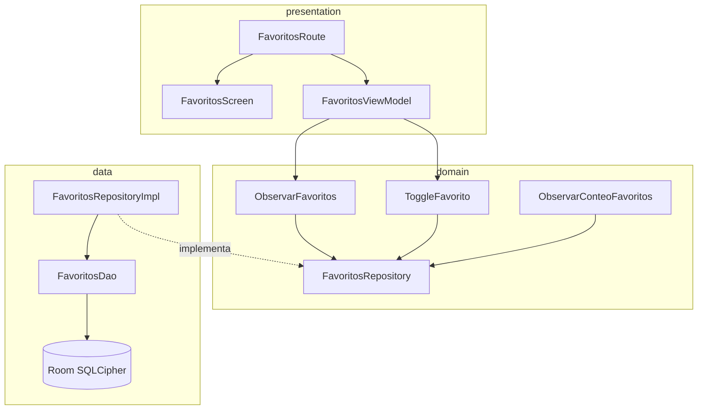

# Diseño interno: `:features:favorites`

## Diagrama de flujo



## Flujo SSOT local

```
FavoritosDao.observarFavoritos() : Flow<List<FavoritoEntity>>
    └─ FavoritosRepositoryImpl.observarFavoritos()
         → map { entities → Either.Right(entities.map { it.toDomain() }) }
              └─ ObservarFavoritos.invoke() : Flow<Either<DomainError, List<Favorito>>>
                   └─ FavoritosViewModel.cargarFavoritos().collect { ... }
                        └─ _uiState: Loading → Content / Empty / Error
```

El `Flow` de Room es "hot" — emite automáticamente cuando la tabla cambia. Esto garantiza que la pantalla de favoritos y el catálogo de productos se actualicen reactivamente sin polling.

## Integración con `:features:products`

`ProductosViewModel` utiliza `combine(obtenerProductos(), observarFavoritos())` para enriquecer cada `ProductoUi` con `esFavorito: Boolean`. Cuando el usuario hace toggle desde el catálogo, el evento `ProductosUiEvent.ToggleFavorito(producto)` llama a `ToggleFavorito` en el dominio → Room actualiza la tabla → ambos Flows emiten → la UI se actualiza en tiempo real.

## Decisiones de diseño

| Decisión | Justificación |
|---|---|
| Solo persistencia local (Room), sin API REST | Los favoritos son preferencias personales; sin auth activa no hay usuario en servidor. Puede extenderse a sincronización remota en futuras etapas. |
| `observarConteo()` devuelve `Flow<Int>` sin `Either` | El conteo nunca falla silenciosamente; los errores de Room en lectura simple se propagan como excepciones que el `CoroutineExceptionHandler` del caller captura. |
| `toggleFavorito` usa `esFavorito()` + insert/delete atómico | Evitar doble-insert (ON CONFLICT REPLACE ya lo cubriría, pero la lógica explícita mejora la legibilidad y el testing de ramas). |
| `safeDbCall` en todas las escrituras y lecturas puntuales | Centraliza el mapeo `Throwable → DomainError.Database.*` conforme a §7 del prompt maestro. |
| `FavoritosRepositoryImpl.observarFavoritos()` no usa `safeDbCall` | El Flow de Room emite excepciones via el mecanismo de corrutinas; se maneja a nivel del `CoroutineExceptionHandler` del ViewModel que lo colecta. |

## Puntos de extensión

- **Sincronización remota**: Añadir `FavoritosRemoteDataSource` + `safeApiCall` en `FavoritosRepositoryImpl`. El dominio y la presentación no cambian.
- **Contador de badge**: Inyectar `ObservarConteoFavoritos` en `ProfileViewModel` para mostrar un badge reactivo.
- **Compartir favoritos**: Añadir `UiEvent.Compartir(favorito)` y el efecto correspondiente sin tocar la capa de datos.
