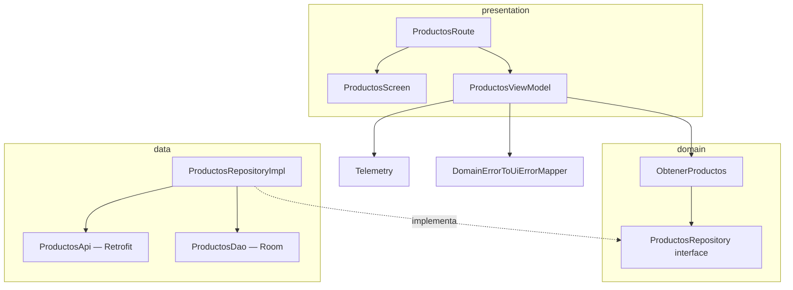

# Diseño — `:features:products`

## Diagrama de flujo



## Patrón SSOT (Single Source of Truth)

El repositorio sigue este flujo:
1. **Caché primero**: si Room tiene datos, los emite inmediatamente.
2. **Actualización de red**: llama a la API con `safeApiCall`.
3. **Actualizar caché**: si la red responde correctamente, reemplaza Room con los nuevos datos y vuelve a emitir.
4. **Fallo sin caché**: si la red falla y no había caché, emite `Either.Left(DomainError)`.

```
dao.observarProductos() → (si hay datos) emit Right
     ↓
safeApiCall(api.obtenerProductos())
     ↓ Right          ↓ Left
dao.borrarTodos()   (si había caché, silenciar error)
dao.insertarProductos()  (si no había caché, emit Left)
dao.observarProductos() → emit Right (datos frescos)
```

## Decisiones de diseño

| Decisión | Razón |
|---|---|
| `Flow<Either<DomainError, T>>` en lugar de `suspend Either<DomainError, T>` | Permite emitir datos de caché primero y luego datos frescos de red sin cambiar la firma del contrato |
| Room como SSOT | Los datos de red nunca se emiten directamente; siempre pasan por Room para garantizar consistencia |
| `@HiltViewModel` con `CoroutineExceptionHandler` | Captura excepciones inesperadas (por ejemplo, OOM) sin crashear la app, reportándolas a Telemetría |
| `ProductosRoute` separa `hiltViewModel()` de `ProductosScreen` | `ProductosScreen` es testeable con Compose Testing sin dependencias de Hilt |
| `MangoProductCard`, `MangoErrorState`, etc. | Garantiza consistencia visual con el design system; prohibe imports directos de Material3 |

## Puntos de extensión

- **Paginación**: `ProductosRepositoryImpl` puede adaptarse a `Pager` + `PagingSource` de Paging 3 sin cambiar la interfaz `ProductosRepository`.
- **Ordenación / filtrado**: agregar `ObtenerProductosPorCategoria` como nuevo caso de uso en `domain/usecase/`.
- **Detalle de producto**: añadir `ProductoDetalleRoute` + `ProductoDetalleViewModel` en `presentation/` consumiendo un nuevo caso de uso `ObtenerProductoPorId`.
