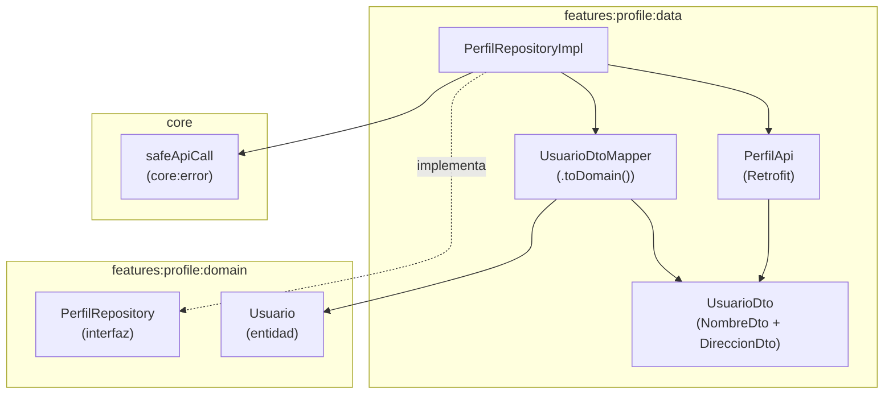

# Diseño — `:features:profile:data`

## Diagrama de flujo



## Flujo de datos detallado

```
PerfilRepositoryImpl.obtenerPerfil(userId)
  └─ safeApiCall {
       api.obtenerUsuario(userId)         → UsuarioDto (JSON deserializado)
         └─ .toDomain()                   → Usuario (entidad dominio)
     }
     ├─ éxito → Either.Right(Usuario)
     └─ error → Either.Left(DomainError.*) (mapeado por safeApiCall)
```

## Mapeo de campos DTO → dominio

| Campo `UsuarioDto` | Campo `Usuario` | Transformación |
|--------------------|-----------------|----------------|
| `id` | `id` | Directo |
| `name.firstname + name.lastname` | `nombreCompleto` | `"${firstname} ${lastname}"` |
| `username` | `nombreUsuario` | Directo |
| `email` | `email` | Directo |
| `phone` | `telefono` | Directo |
| `address.city` | `ciudad` | Directo |
| `address.street + address.number` | `calle` | `"${street} ${number}"` |
| `address.zipcode` | `codigoPostal` | Directo |
| `password` | — | **Descartado** — no expuesto en dominio |
| `address.geolocation` | — | **Descartado** — no necesario |

## Decisiones de diseño

| Decisión | Justificación |
|----------|---------------|
| Sin caché Room | El perfil es de sólo lectura; la ganancia de consistencia no justifica la complejidad de Room |
| `safeApiCall` en repositorio | Centraliza el mapeo de `IOException`/`HttpException` a `DomainError` |
| `@Serializable` en DTOs | Kotlin Serialization es la librería estándar del proyecto; compatible con la configuración de Retrofit |
| Omitir `password` del DTO | Principio de menor privilegio; el dato no aporta valor a la UI |

## Puntos de extensión

- Si se añade caché offline, `PerfilRepositoryImpl` combinará `PerfilApi` con un `PerfilDao` (Room), sin cambiar la interfaz de dominio.
