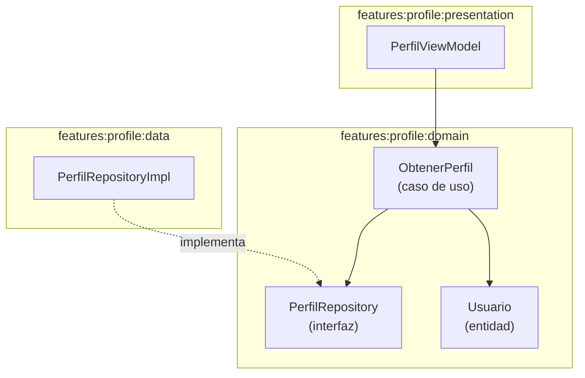

# Diseño — `:features:profile:domain`

## Diagrama de flujo

## Decisiones de diseño

| Decisión | Justificación |
|----------|---------------|
| `ObtenerPerfil` precondición `require(userId > 0)` | Fail-fast ante datos de entrada inválidos; evita llamadas de red innecesarias |
| Sin caché Room en dominio | El perfil es de sólo lectura y cambia poco; costo de consistencia supera el beneficio |
| `Either<DomainError, Usuario>` en lugar de excepciones | Manejo de errores explícito y tipado; compatible con `fold` en ViewModel |
| `userId = 8` hardcodeado temporalmente | La feature `:features:auth` aún no existe; la constante vive en `PerfilViewModel.PERFIL_USER_ID` |

## Puntos de extensión

- Cuando `:features:auth` esté disponible, `ObtenerPerfil` recibirá `userId` del `SessionRepository` en lugar de la constante.
- Si se añade edición de perfil, se creará `ActualizarPerfil` como segundo caso de uso sin modificar `ObtenerPerfil`.
