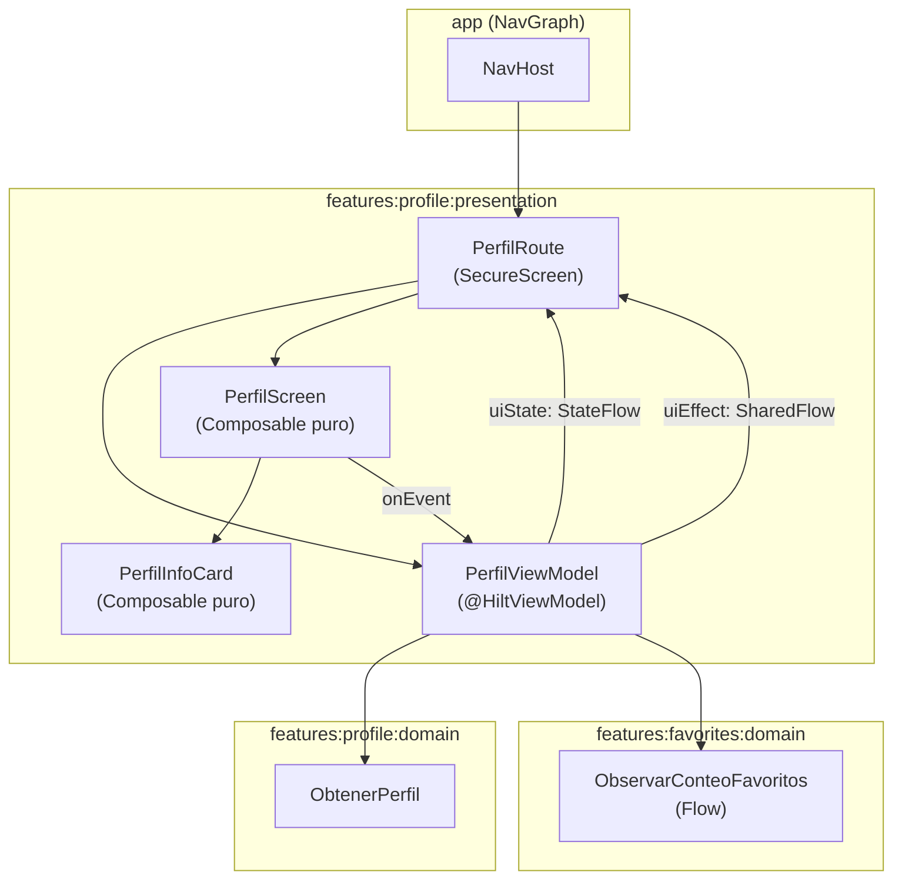

# Diseño — `:features:profile:presentation`

## Diagrama de flujo



## Flujo reactivo del contador de favoritos

```
PerfilViewModel.cargarPerfil()
  └─ combine(
       flow { emit(obtenerPerfil(PERFIL_USER_ID)) },   // emite una sola vez
       observarConteoFavoritos()                         // Flow continuo de Room
     ) { perfilResult, conteo ->
       perfilResult.fold(
         ifLeft  → PerfilUiState.Error(errorMapper.map(error))
         ifRight → PerfilUiState.Content(PerfilContenidoUi(..., contadorFavoritos = conteo))
       )
     }.collect { estado → _uiState.update { estado } }
```

Cuando el usuario marca/desmarca un favorito desde otra pantalla, `observarConteoFavoritos()` emite el nuevo conteo y `combine` genera un nuevo `Content` con el contador actualizado sin rellamar al servidor.

## Manejo de `SecureScreen`

`PerfilRoute` envuelve `PerfilScreen` en `SecureScreen { ... }`. Este composable aplica `FLAG_SECURE` a la `Window` mediante `DisposableEffect`, evitando capturas de pantalla. Durante `LocalInspectionMode` (previews de Android Studio) el flag no se aplica para no bloquear los previews.

## Estados de UI

| Estado | Composable renderizado | Condición |
|--------|------------------------|-----------|
| `Loading` | `MangoLoadingIndicator` | Inicial y durante reintentos |
| `Content(usuario)` | `PerfilInfoCard` | Datos cargados correctamente |
| `Error(uiError)` | `MangoErrorState` | Cualquier `DomainError` |

## Gestión de errores no fatales

`PerfilViewModel` tiene un `CoroutineExceptionHandler` que captura errores no controlados del `viewModelScope`, los reporta a `Telemetry` como no fatales y emite `PerfilUiState.Error(DomainError.Unknown)`.

## Decisiones de diseño

| Decisión | Justificación |
|----------|---------------|
| `PerfilUiErrorMapper` como delegador | Reutiliza `DomainErrorToUiErrorMapper` para todos los errores excepto `NotFound`, que tiene mensaje localizado propio |
| `combine()` en lugar de `zip()` | `combine` re-emite cuando cualquiera de los dos flujos emite; permite actualizar el contador sin re-fetch |
| `PERFIL_USER_ID = 8` constante | Temporal hasta que `:features:auth` provea el userId real de sesión |
